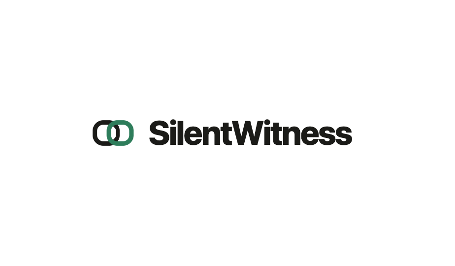

<p align="center">
  
</p>

# SilentWitness

[](.github/workflows/ci.yml)
[](./LICENSE)
[](https://findevil.devpost.com/)

SilentWitness turns a single incident responder into the manager of an agentic DFIR
team. The investigator runs hypothesis-first against a per-case evidence index;
every claim it stages is verified against the bytes of the cited evidence row;
every approved finding ships with a hash-chained, examiner-signed audit trail.

> **Important.** This is a hackathon submission. ALWAYS verify findings against the
> audit chain and the cited evidence; do not skip examiner review. Findings backed
> by a single evidence category ship as `UNVERIFIED` — the corroboration tier is the
> signal you read before trusting them. The agent can accelerate, but the human must
> guide it and review all decisions.

## Required resources

| Component | RAM (min) | RAM (rec) | Disk | Notes |
|---|---|---|---|---|
| SilentWitness MCP server | 8 GB | 16 GB | 25 GB + evidence | Python 3.12 + uv. CPU-bound at index time; memory-bound during vol3 passes. |
| Volatility 3 venv | +8 GB | +12 GB | +1 GB | Vendored at `/opt/silentwitness/vol3-venv/bin/vol`. Required for memory-dump analysis. |
| ROCBA case (Standard) | — | — | ~30 GB | 24 GB E01 disk + 5.7 GB memory image + extracted artifacts + index. |
| SRL-2015 / SRL-2018 (multi-host APT) | — | — | ~200 GB | 4 hosts each, ~15 GB compressed per host. Out of scope for v1.0; see [Multi-host note](./docs/internal/MULTI_HOST_NOTE.md). |

SIFT Workstation 2026 OVA is the reference runtime — it already ships plaso,
SleuthKit, libewf, libevtx, libesedb, regripper, bulk_extractor, and Volatility 3.
`install.sh` adds the permissive delta (Hayabusa, Chainsaw, Sigma rules, spaCy NER
model, dfvfs, regipy). Any Ubuntu 22.04+ with the same prerequisites works.

## Architecture

<p align="center">
  
</p>

The CLI drives a Pydantic AI investigator. The investigator's only discovery
surface is the Custom MCP server, which exposes `search_evidence`, `timeline`,
`list_detections`, and `get_record` over a per-case SQLite + FTS5 evidence index.
The agent never reads raw evidence into context — it issues bounded index queries.
Every tool call is logged to a per-backend hash-chained `audit/*.jsonl`. The
per-case approval ledger is HMAC-signed by the examiner.

The structural guardrails — citation gate (every quoted span must be a verbatim
substring of the cited row), entity gate (every named IOC / user / path must
appear in a cited span), corroboration tier (≥2 distinct evidence categories →
`CONFIRMED`), 5-Key-Questions coverage gate (typed output validator), live critic
(`CHALLENGE → revise / pivot`), hash-chained audit (`prev_record_hash +
record_hash`) — run in code, not in prompts. Switching MCP clients (Claude Code,
Claude Desktop, Cherry Studio, LibreChat, Continue) does not relax any guardrail.

Read deeper: [`docs/architecture.md`](./docs/architecture.md).

## Prerequisites

Before installing, have these ready:

1. **OS.** Ubuntu 22.04+ (SIFT 2026 OVA is the reference) or macOS for local
   development.
2. **Python 3.12.** Check with `python3 --version`. On the SIFT OVA, install via
   the deadsnakes PPA or use `uv python install 3.12`.
3. **`uv`** — the Python package manager we use to install SilentWitness itself.
   Install: `curl -LsSf https://astral.sh/uv/install.sh | sh`.
4. **`git`** for cloning the repository.
5. **`sudo`** access on the install machine — `install.sh` writes the vendored
   forensic tools under `/opt/`.
6. **An LLM provider you have an account with.** SilentWitness is model-agnostic
   and routes through [Pydantic AI](https://ai.pydantic.dev/api/models/). One of:
   - **Anthropic** — `ANTHROPIC_API_KEY` env var. Tested model:
     `anthropic:claude-opus-4-7`.
   - **OpenAI** — `OPENAI_API_KEY` env var. Tested model: `openai:gpt-5.2`.
   - **Google Gemini** — `GEMINI_API_KEY`. Or Ollama / vLLM for self-hosted
     (see the model-prefix list in [Configuration](#configuration)).

You only need ONE provider — pick whichever you already pay for.

## Installation

```bash
# 1. Clone the repository.
git clone https://github.com/Blockchain-Oracle/silentwitness.git
cd silentwitness

# 2. Install the Python package + dependencies (creates .venv automatically).
uv sync

# 3. Install the forensic subprocess tools (Hayabusa, Chainsaw, Sigma rules,
#    Zeek, Suricata, spaCy NER model, dfvfs, regipy). Idempotent — re-running
#    skips already-installed tools. Requires sudo for /opt/ writes.
sudo ./install.sh

# 4. Install Volatility 3 in its own venv (used for memory-dump analysis).
#    Skip if you won't analyze memory.
sudo python3 -m venv /opt/silentwitness/vol3-venv
sudo /opt/silentwitness/vol3-venv/bin/pip install volatility3==2.27.0
```

The CLI is `silentwitness`. Run `uv run silentwitness --help` to see all commands.

## Configuration

SilentWitness reads everything from environment variables. Set them in your shell
profile, a `.env` file you `source`, or pass them per-command.

**LLM provider key** (pick one based on your `SILENTWITNESS_MODEL` choice below):

| Variable | When required |
|---|---|
| `ANTHROPIC_API_KEY` | Whenever `SILENTWITNESS_MODEL` starts with `anthropic:`. |
| `OPENAI_API_KEY` | Whenever `SILENTWITNESS_MODEL` starts with `openai:`. |
| `GEMINI_API_KEY` | Whenever `SILENTWITNESS_MODEL` starts with `google:`. |

**SilentWitness env vars:**

| Variable | Default | What it does |
|---|---|---|
| `SILENTWITNESS_MODEL` | `anthropic:claude-opus-4-7` | Which LLM the investigator drives. Format is `<provider>:<model-id>`. Tested: `openai:gpt-5.2`, `anthropic:claude-opus-4-7`. Supports `vllm:<base-url>` for self-hosted. |
| `SILENTWITNESS_CRITIC_MODEL` | same as `SILENTWITNESS_MODEL` | The critic that adversarially reviews findings can be a cheaper model. We use `openai:gpt-5-mini` in production for cost. |
| `SILENTWITNESS_CRITIC_FAST` | unset | Skip the deeper critic pass for faster iteration. |
| `SILENTWITNESS_MAX_ITERS` | unset (unlimited) | Cap on model API calls per `investigate` run. Default: unlimited; the agent self-terminates via the coverage gate + structured output. Set only if you want a safety belt. |
| `SILENTWITNESS_CASES_DIR` | current working directory | Where `cases/<case-id>/` lives. |
| `SILENTWITNESS_GT_DIR` | `harness/ground_truth` | Used by `baseline-comparison`. |

Example `.env` for a single OpenAI run:

```bash
export OPENAI_API_KEY=sk-…
export SILENTWITNESS_MODEL=openai:gpt-5.2
export SILENTWITNESS_CRITIC_MODEL=openai:gpt-5-mini
```

## Quick start (ROCBA case)

```bash
# 0. Configure (see Configuration above) — set your API key + model.
source .env

# 1. Download the SANS Find Evil! ROCBA starter case (~30 GB). Optional if you
#    already have your own evidence.
python scripts/download_starter_cases.py download rocba

# 2. Create the case folder + register evidence.
uv run silentwitness init rocba --examiner $USER
uv run silentwitness register-evidence rocba ./evidence/rocba-cdrive.e01
uv run silentwitness register-evidence rocba ./evidence/Rocba-Memory.raw --as memory_dump

# 3. Extract artifacts from the disk image + build the searchable evidence index.
uv run silentwitness prepare rocba
uv run silentwitness index rocba

# 4. Investigate — agent runs hypothesis-first, self-terminates via coverage gate.
uv run silentwitness investigate rocba --no-hud

# 5. Review the staged findings (interactive), then approve.
uv run silentwitness review rocba
uv run silentwitness approve rocba

# 6. Verify and export the final report.
uv run silentwitness verify --audit-chain rocba
uv run silentwitness export rocba
```

The final report lands at `cases/rocba/report.md` with inline `[verify:audit_id]`
links every reader can click through to the JSONL audit row that produced it.

## Commands

All commands take `--help` for full options. `<case>` is the case id you chose at
`init`.

| Command | What it does |
|---|---|
| `silentwitness init <case>` | Create a new case directory. Initializes audit ledger + per-case HMAC salt. |
| `silentwitness register-evidence <case> <path>` | Hash a file and record it in the case manifest. `--as <type>` overrides auto-detection for ambiguous suffixes (e.g. `.raw` memory dumps). |
| `silentwitness prepare <case>` | Extract artifacts from registered disk images using dfvfs. |
| `silentwitness index <case>` | Parse every prepared artifact into the per-case SQLite/FTS5 evidence index. Runs Sigma + vol3 + targeted feeders in parallel. |
| `silentwitness investigate <case>` | Run the hypothesis-first investigator. Reads from the index, stages observations + interpretations, fires the live critic, self-terminates via the coverage gate. |
| `silentwitness status <case>` | Show current state of a case (hypotheses, observations, findings, audit row count). |
| `silentwitness review <case>` | Interactive examiner review of staged findings. Materializes observations into findings; assigns corroboration tier. |
| `silentwitness approve <case>` | Sign approved findings with the per-case HMAC salt; writes to the tamper-evident approval ledger. |
| `silentwitness verify <case>` | Reconcile the approval ledger. `--audit-chain` instead walks every `audit/*.jsonl` and verifies the hash chain (Phase 6b). |
| `silentwitness export <case>` | Render the IR report (Markdown + optional PDF). |
| `silentwitness install` | Register the MCP server with Claude Code (`silentwitness install --claude-code`). Optional — any MCP-compatible client works. |
| `silentwitness baseline-comparison <case>` | Run the accuracy harness against the Protocol-SIFT baseline on the case. |

## Repository layout

```
silentwitness/
├── README.md             ← you are here
├── install.sh            ← installs the forensic subprocess tools (sudo)
├── pyproject.toml        ← Python package + deps
├── docker-compose.yml    ← optional containerised deployment
├── assets/               ← branding (logo, diagrams, hero)
│   └── diagrams/         ← architecture diagrams A through F
├── src/
│   ├── silentwitness_mcp/     ← the MCP server (the product)
│   │   ├── index/             ← evidence ingest pipeline
│   │   ├── findings/          ← observation → interpretation → finding chain
│   │   ├── verification/      ← citation gate + entity gate + sanitizer
│   │   ├── audit/             ← chain logger + HMAC ledger
│   │   └── detect/            ← Sigma pre-staging
│   └── silentwitness_agent/   ← reference Pydantic AI investigator + CLI
│       ├── investigator.py    ← agent loop
│       ├── critic.py          ← live critic
│       ├── report/            ← report composer + writer
│       └── cli_commands/      ← one file per `silentwitness <command>`
├── scripts/
│   └── download_starter_cases.py   ← Egnyte API downloader for SANS share
├── tests/                ← 1800+ unit + integration tests
├── harness/              ← accuracy harness (Protocol-SIFT comparison)
└── docs/                 ← user-facing documentation
    ├── architecture.md         ← the deep-dive
    ├── SETUP_GUIDE.md          ← step-by-step setup for non-developers
    ├── TRY_IT_OUT.md           ← per-case walkthroughs
    ├── ACCURACY_REPORT.md      ← measured Δ vs Protocol-SIFT baseline
    ├── THREE_CLAIM_TRACE.md    ← trace one finding end-to-end
    ├── DATASETS.md             ← provenance + memorization risk per case
    ├── diagrams/architecture.mmd  ← maintainable mermaid source
    ├── execution_logs/         ← real audit JSONL from past runs
    └── internal/               ← development notes (PRD, audit, stories)
```

A case directory under `cases/<case-id>/` looks like:

```
cases/rocba/
├── CASE.yaml                ← per-case HMAC salt (auto-generated at init)
├── evidence.json            ← registered evidence manifest (sha256 + size)
├── index.db                 ← SQLite FTS5 evidence index
├── prepared/                ← extracted artifacts from disk images
├── findings.json            ← observations, interpretations, findings
├── report.md                ← the final IR report
├── audit/                   ← hash-chained JSONL audit per backend
│   ├── cli.jsonl
│   ├── agent.jsonl
│   ├── findings.jsonl
│   ├── critic.jsonl
│   └── hypothesis.jsonl
└── .silentwitness/case.toml ← case metadata (examiner, etc.)
```

## Documentation

- [Setup guide](./docs/SETUP_GUIDE.md) — non-developer-friendly walkthrough from
  blank OVA to a finished report.
- [Try it out](./docs/TRY_IT_OUT.md) — per-dataset walkthroughs.
- [Accuracy report](./docs/ACCURACY_REPORT.md) — measured recall vs Protocol-SIFT
  baseline, honest failure modes.
- [Three-claim trace](./docs/THREE_CLAIM_TRACE.md) — pick a finding, click through
  to the audit row that produced it.
- [Datasets](./docs/DATASETS.md) — case provenance + memorization-risk
  disclosure.
- [Architecture deep-dive](./docs/architecture.md) — components, the 27-tool MCP
  catalog, ADRs.

## License

[MIT](./LICENSE) — see [`NOTICES.md`](./NOTICES.md) for third-party attributions
and the GPL/AGPL subprocess tools linkage analysis.

## Acknowledgments

Built against the [AppliedIR / Valhuntir](https://github.com/AppliedIR/Valhuntir)
bar SANS cites as the IR-agent target; baseline comparison against
[teamdfir / protocol-sift](https://github.com/teamdfir/protocol-sift) for the
vanilla SIFT 2026 reference. Datasets sourced from SANS Find Evil! 2026, NIST DFR
/ CFReDS, and Nitroba (Wireshark University). Documentation patterns inspired by
the official [Model Context Protocol servers](https://github.com/modelcontextprotocol/servers).
