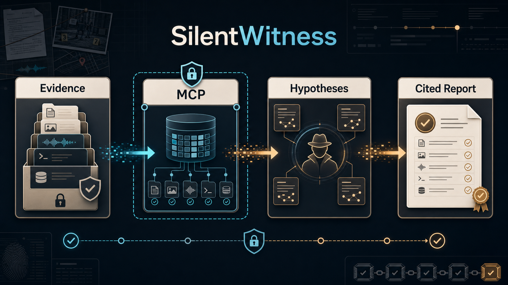
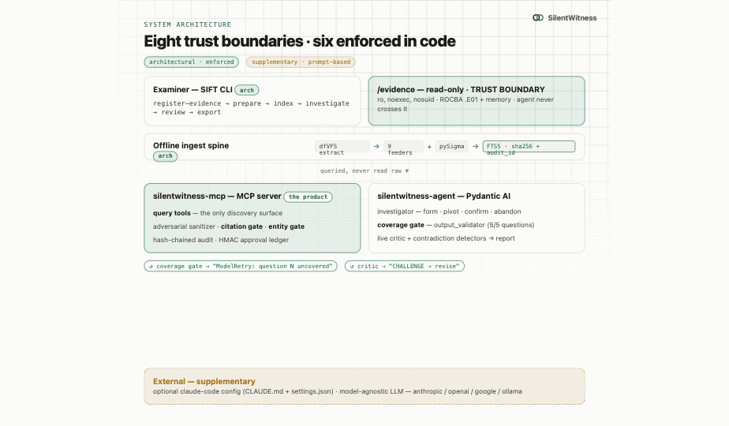
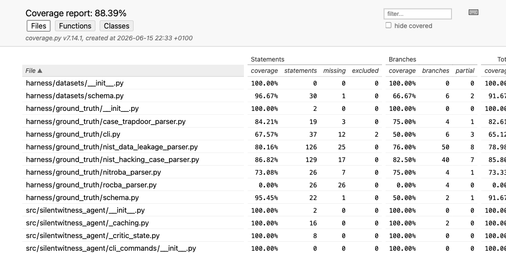

# SilentWitness

> SilentWitness — a hypothesis-first DFIR investigator whose report writes itself, with every claim locked to the tool that produced it.

[](./LICENSE) [](pyproject.toml) [](.github/workflows/ci.yml) [](docs/architecture.md)

Built for the SANS [Find Evil!](https://findevil.devpost.com/) hackathon (2026).

**New here? Start with the [complete step-by-step setup & usage guide](./docs/SETUP_GUIDE.md)** —
written so anyone (not just developers) can go from a blank SIFT VM to a finished report.

**Result on the real SANS ROCBA case:** with the enforced coverage gate and a capable model,
SilentWitness recalled **10 of 10** ground-truth findings. See the honest measurement (and the
failure modes we found and fixed) in the [Accuracy Report](./docs/ACCURACY_REPORT.md), and trace
any finding to its tool execution in the [Three-Claim Trace](./docs/THREE_CLAIM_TRACE.md).

## Demo

📺 **Demo video:** [vimeo.com/1201573890](https://vimeo.com/1201573890)



## Prerequisites

| Requirement | Why | How |
|---|---|---|
| **Python 3.12 or 3.13** | `silentwitness` is a Python CLI. | SIFT 2026 has 3.12 pre-installed. Other OS: [python.org](https://www.python.org) or your package manager. |
| **LLM API key** | The investigator drives an LLM (Anthropic / OpenAI / Gemini / Ollama). Recommended: `gpt-5.2` or `claude-opus-4-7`. | Export `ANTHROPIC_API_KEY`, `OPENAI_API_KEY`, or `GEMINI_API_KEY` before `silentwitness investigate`. |
| **`uv` (or `pipx`)** | Installs `silentwitness` as a global command in an isolated env. | `install.sh` installs `uv` automatically. Alt: [astral.sh/uv](https://astral.sh/uv) / [pipx](https://pipx.pypa.io). |
| **Subprocess forensic tools** *(SIFT only)* | Hayabusa, Chainsaw, Sigma rules, Zeek, Suricata, dfVFS. | `install.sh` provisions them all — version-pinned + SHA256-verified. |

## Install

After any path below, **`silentwitness` is a global command** — `which silentwitness` resolves and `silentwitness --help` works from any directory.

### Option A — SIFT 2026 OVA (recommended for judges, one command)

```bash
git clone https://github.com/Blockchain-Oracle/silentwitness && cd silentwitness && ./install.sh
silentwitness --help    # global command, ready
```

`install.sh` is idempotent. It installs `uv`, runs `uv tool install` to put the CLI on `~/.local/bin`, then provisions Hayabusa / Chainsaw / Sigma rules / Zeek / Suricata / dfVFS apt deps / spaCy NER model. Every download is SHA256-verified.

### Option B — Generic (any OS, no SIFT subprocess tools)

```bash
# Recommended (uv tool):
curl -LsSf https://astral.sh/uv/install.sh | sh
export PATH="$HOME/.local/bin:$PATH"
uv tool install "git+https://github.com/Blockchain-Oracle/silentwitness@main"

# Alternative (pipx):
pipx install "git+https://github.com/Blockchain-Oracle/silentwitness@main"

# Alternative (npm — discoverability alias; delegates to uvx):
npm install -g silentwitness
```

### Option C — Docker Compose

```bash
docker compose up -d
docker compose exec silentwitness silentwitness investigate mr-evil-001
```

## Configuration

| Env var | Default | What |
|---|---|---|
| `SILENTWITNESS_MODEL` | `openai:gpt-5.2` | Investigator model. Format: `provider:model`. |
| `CRITIC_MODEL` | (inherits) | Live critic model — usually a faster/cheaper sibling of the investigator. |
| `MAX_ITERS` | unlimited | Hard cap on agent iterations. Unlimited by default (PR #236); three self-termination signals — structured output, token budget, coverage-gate retry exhaustion — still stop the run. |
| `CASES_DIR` | `./cases` | Where investigations are written. |
| `ANTHROPIC_API_KEY` / `OPENAI_API_KEY` / `GEMINI_API_KEY` | _at least one required_ | LLM provider credential. |

## Quick start

After install + at least one LLM API key exported:

```bash
silentwitness init mr-evil-001 --examiner "$USER"
silentwitness register-evidence mr-evil-001 /evidence/hacking-case
silentwitness prepare mr-evil-001
silentwitness index mr-evil-001
silentwitness investigate mr-evil-001
silentwitness review mr-evil-001                    # materialise findings
silentwitness verify --audit-chain mr-evil-001      # tamper-evident audit trail
silentwitness export mr-evil-001 --md
```

### What those commands mean

| Command | What it does |
|---|---|
| `init` | Creates the case folder, empty report, audit logs, evidence registry, and per-case verification salt. |
| `register-evidence` | Records an evidence file or starter-case folder, classifies artifact types, computes hashes, and refuses unsafe writable evidence mounts. |
| `prepare` | Extracts high-value artifacts from registered evidence read-only: event logs, registry hives, file tables, shortcuts, prefetch, memory archives, and similar inputs. |
| `index` | Parses prepared artifacts into `cases/<case-id>/index.db`, the searchable evidence index the agent is allowed to query. |
| `investigate` | Runs the hypothesis-first agent. It searches the index, records cited observations, pivots when challenged, and stages findings. |
| `review` | Lets the examiner inspect staged findings before they become accepted report material. |
| `verify --audit-chain` | Recomputes every audit JSONL hash chain and reports tampering or missing audit links. |
| `export` | Writes the finished report and optional PDF/IOC outputs from the reviewed findings. |

## Architecture



**Eight boundaries, six of them architectural.** Verification gates (entity gate, citation gate, HMAC audit chain), the `ro,noexec,nosuid` evidence mount, and the per-specialist MCP toolset run in code — not in prompts. The two prompt-based guardrails (investigator system prompt + critic agreement prompt) are *supplementary*: removing them degrades quality but doesn't unlock hallucinations against unmounted artifacts.

## What's novel

SilentWitness is the first hypothesis-first DFIR agent to ship the *architectural* guardrails the IR community has been asking prompt-based agents to fake. The investigator can't claim against an artifact the entity gate can't resolve. The report can't include a finding the citation gate can't link to a real audit-JSONL line. Every Δ vs vanilla Protocol SIFT in the [accuracy report](./docs/ACCURACY_REPORT.md) is **measured, not estimated** — `silentwitness baseline-comparison <case-id>` reruns the comparison on demand.

## Try it out

Per-case walkthroughs (Nitroba, NIST Hacking Case, NIST Data Leakage): see [`docs/TRY_IT_OUT.md`](./docs/TRY_IT_OUT.md).

## Accuracy report

Measured Δ vs vanilla Protocol SIFT 2026 baseline: see [`docs/ACCURACY_REPORT.md`](./docs/ACCURACY_REPORT.md).

## Starter Cases

Provenance + memorization-risk disclosure per case: see [`docs/STARTER_CASES.md`](./docs/STARTER_CASES.md).

## Example execution logs

Real audit JSONL output from past runs: see [`docs/EXAMPLE_EXECUTION_LOGS/`](./docs/EXAMPLE_EXECUTION_LOGS/).

## Architecture deep-dive

Component architecture, the 12-tool agent-visible MCP surface, offline ingest spine, and ADRs:
see [`docs/architecture.md`](./docs/architecture.md).

## Test coverage

**88.39% line coverage** across 7,500+ executable lines, **1,838 tests** passing (unit + integration + property-based via [Hypothesis](https://hypothesis.readthedocs.io)). 46 modules at 100% coverage — including the hash-chained audit primitives, every verification gate, the corroboration tier engine, and the entity-gate sanitizer.



Reproduce locally:

```bash
uv run coverage run -m pytest
uv run coverage html
open htmlcov/index.html
```

Tests run on every push: see [`.github/workflows/ci.yml`](./.github/workflows/ci.yml). The coverage gate is enforced per-package: `verification/` 95%, `audit/` + `findings/` 90%, everywhere else 85% — the floors that catch silent failures before merge.

## License

[MIT](./LICENSE) — see [`NOTICES.md`](./NOTICES.md) for third-party attributions.

## Acknowledgments

Built against the **AppliedIR / Valhuntir** bar SANS cites as the IR-agent target; baseline comparison against **teamdfir / protocol-sift** for the vanilla SIFT 2026 reference path. Evidence corpora are sourced from Nitroba (Wireshark University) and NIST (DFR / CFReDS).
