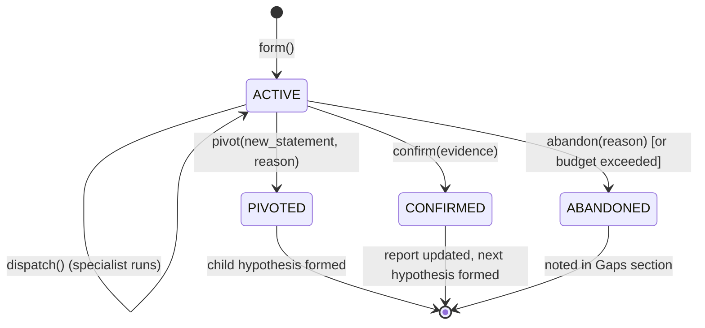
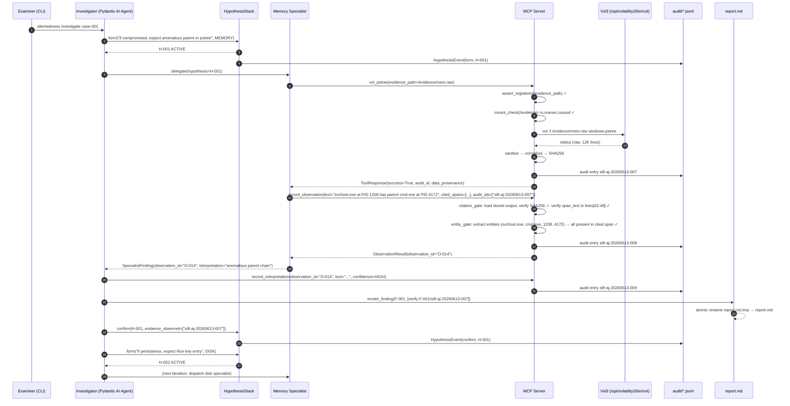
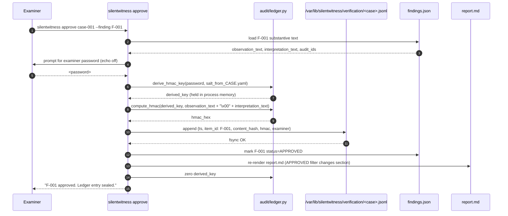
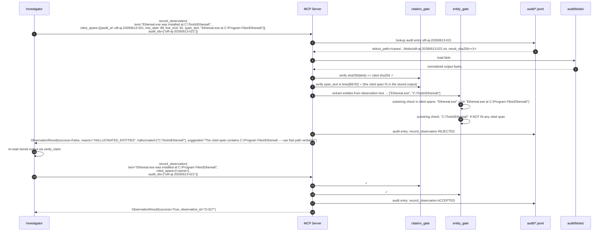

# Architecture — SilentWitness

**Status:** DRAFT (locks after Abu approval)
**Last updated:** 2026-06-02
**Project name (verbatim, never paraphrased):** SilentWitness
**Track:** Custom MCP Server — Devpost overview approach #2 of 4 (*"the most sound architecture in the evaluation"*)
**Contributes to judging criteria:** all six, with Constraint Implementation, Audit Trail Quality, and Usability primary.
**Source documents read before authoring:** `../STRATEGY.md`; `./BRAINSTORM.md`; `./PRD.md`; `./CICD_SPEC.md`; `../context/.raw-design-research/02-model-agnostic-agent-libraries-survey.md`; `../context/.raw-design-research/03-sift-2026-tool-catalog-verified.md`; `../context/technical/07-mcp-and-agent-platforms.md`; `../context/technical/08-llm-failure-modes-in-agentic-systems.md`; `../context/competitive/11-reference-implementations-decomposed.md`.

This document is the densest of the spec set. It does not duplicate CI gates (see `CICD_SPEC.md`), product requirements (see `PRD.md`), CLI ergonomics (see `ux-spec.md`, deferred), or epic/story breakdowns (see `epics.md`, deferred). It defines the components, their interfaces, the trust boundaries between them, and the architectural mechanisms that make hallucinated findings impossible to record.

---

## 1. Stack — locked

Every entry below is committed. Each carries a 1–2 sentence rationale and the source doc that informed the choice.

| Concern | Choice | Pin | Rationale + source |
|---|---|---|---|
| Python runtime | CPython | `>=3.12,<3.14` | SIFT 2026 ships Python 3.12 on Ubuntu 24.04.2 Noble (`context/.raw-design-research/03` row "Default Python"). 3.13 forward-compat tested in CI matrix per `CICD_SPEC` §4.1. |
| Package manager | `uv` | `==0.11.18` | 10–100× faster than poetry/pip; single static binary; reproducible `uv.lock`. Exact-pin per audit B-PY-2 (0.5.x has breaking semantics changes vs. 0.11 — `uv venv --clear` now required, multi-default-index errors, `exclude-newer` semantics changed). SIFT 2026 does NOT ship `uv` — `install.sh` bootstraps it. |
| Linter + formatter | `ruff` | `>=0.8` | Replaces black + isort + flake8 + pylint; single Rust-fast tool with one config in `pyproject.toml`. |
| Type checker | `mypy` strict | `>=1.13` | Boring, works, well-known. Pyright fallback only if mypy stalls on a release. |
| Test framework | `pytest` + `hypothesis` | `>=8` / `>=6` | Property tests catch verification-gate edge cases the example-based tests miss. |
| Coverage | `coverage[toml]` | `>=7.6` | TOML-config; per-module floors enforced by `scripts/coverage_gate.py`. |
| MCP server | `mcp` (FastMCP) | `>=1.23.0,<2.0` | Official Anthropic SDK; Pydantic-native; native stdio + Streamable HTTP transports. **Pin floor closes CVE-2025-66416 (DNS-rebinding protection default-off before 1.23.0 — our "127.0.0.1-only is enough" defense collapses on pre-1.23) + CVE-2025-53366 (DoS, fixed 1.9.4).** Ceiling avoids v2's `FastMCP→MCPServer` breaking rename. Verified against latest stable mcp 1.27.2 (2026-05-29). |
| Agent loop | **`pydantic-ai`** | `>=1.105.0,<2.0.0` | MIT-licensed; MCP-native via `MCPServerStdio` / `MCPServerStreamableHTTP` toolsets (NOTE: `MCPServerHTTP` does NOT exist; `mcp_servers=` kwarg is DEPRECATED — use `toolsets=[...]`); provider-agnostic model strings; first-class `Hooks` capability registered via `Agent(capabilities=[hooks])` (NOT `Agent(hooks=[...])`); agent-delegation primitive for specialists. v1 has had zero breaking changes since v1.0 (Sep 2025); ceiling pin avoids v2 silent semantic changes. |
| Provider extras | `pydantic-ai[anthropic,openai,google-gla,ollama]` | matching | Single install, all four providers as first-class model strings. |
| I/O typing | Pydantic v2 | `>=2.9` | Ecosystem fit with `mcp` and `pydantic-ai`; strict validation; streaming-aware. |
| Crypto | stdlib `hmac` + `hashlib.pbkdf2_hmac` | (stdlib) | No extra deps. PBKDF2-SHA256 at 600,000 iterations matches the Valhuntir pattern (`context/competitive/11` §2 L2, citing `verification.py:33`). |
| Structured logging | direct Pydantic `model_dump_json()` | (stdlib + Pydantic) | **`structlog` DROPPED per audit Decision A** — direct `model_dump_json()` on Pydantic models is right for our write rate; one fewer dep + simpler audit-logger module. |
| CLI | `typer` | `>=0.15` | Type-driven; rich output; wraps Click. CLI ergonomics deferred to `ux-spec.md`. |
| Report PDF | `weasyprint` | `>=68.1,<70.0` | Pattern reuse from Protocol SIFT. **Pin floor closes CVE-2025-68616** (was `>=60,<62` — affected). Native deps cairo/pango/gdk-pixbuf + `libharfbuzz-subset0`, `libpangoft2-1.0-0`, font packages documented in Dockerfile per `CICD_SPEC` §11.1. |
| Markdown processing | `mistune` | `>=3.2.1` | Fast; well-typed; renders inline `[verify:...]` references. **Pin floor closes 6 CVEs in 3.0–3.2.0**: CVE-2026-44708 (XSS math plugin), 44896 (figure directive), 44897 (heading-ID injection), 44899 (CSS injection), 33441 (DoS), 33079 (ReDoS) — all fixed in 3.2.1 (May 2026). |
| Terminal UI | `rich` | `>=14.1,<16` | Pinned floor for nested-Live fix (our HUD pattern). Ceiling avoids breaking changes. |
| HTTP client | `httpx` | `>=0.27` | Async; modern; replaces `requests`. |
| NER | `spacy` `en_core_web_lg` | `spacy>=3.8.10,<3.9` + `en_core_web_lg==3.8.0` | KEEP per audit Decision A — pure regex can't catch hallucinated PERSON/ORG/GPE entities (e.g., "Lazarus Group"), which are the highest-signal hallucination class. ADR-006 stands. |
| Forensic memory | `volatility3` | `==2.27.0` | Pinned in SilentWitness's OWN venv at `/opt/silentwitness/vol3-venv/bin/vol`. Do NOT use SIFT-managed `/opt/volatility3/bin/vol` (SIFT pins no version + Vol3 2.28.0 has live layer-detection regression #1985). Pre-fetch Windows ISF bundle from `downloads.volatilityfoundation.org/volatility3/symbols/windows.zip` into `~/.cache/volatility3/` at init. |
| Property test helpers | `hypothesis` | (above) | (above) |
| Pre-commit | `pre-commit` | `>=4` | Standard. Configured per `CICD_SPEC` §3. |
| File-size guard | local custom hook | (local) | Enforces ≤400 LOC/file (`CICD_SPEC` §6.1). |
| Secret detection | `detect-secrets` | `>=1.5` | Baseline per `CICD_SPEC` §9. |
| SBOM | `cyclonedx-py` | `>=4` | CycloneDX 1.6 JSON; CI artifact + bundled into Docker image. |

### Explicitly NOT using

Each rejection cites the survey doc + a one-sentence reason.

- **Claude Agent SDK** — locks provider to Anthropic. Pydantic AI's agent-delegation primitive is the provider-agnostic equivalent (`context/.raw-design-research/02` §13).
- **LangGraph** — graph DSL + LangChain imports balloon files past the 400-LOC ceiling; durable execution is unneeded for a 5-minute demo (`02` §6).
- **CrewAI / AG2 / AutoGen** — role-play and group-chat overshoot a focused DFIR tool dispatch loop (`02` §7, §8).
- **LiteLLM as primary loop** — 3,537 open issues; sprawl is real. Acceptable as a translator under Pydantic AI for niche providers, not as the loop (`02` §1).
- **Open Interpreter** — AGPL-3.0; license blocker against MIT release (`02` §11).
- **smolagents CodeAgent paradigm** — LLM-authored Python over forensic artifacts is a spoliation risk (`02` §12).
- **Anthropic Python SDK as primary loop** — provider lock; would re-implement Pydantic AI poorly (`02` §13).
- **LangChain / LlamaIndex / Haystack agents** — pre-MCP frameworks bolting MCP on via adapters; the MCP-native frameworks are cleaner (`02` §6, §9, §10).
- **pandas** — Pydantic is enough; pandas pulls C extensions and adds startup cost.
- **requests** — `httpx` is the modern equivalent and async-ready.
- **Click directly** — Typer wraps Click with types; we use Typer.
- **FastAPI / Flask** — CLI is the primary surface. The MCP HTTP transport is served via FastMCP, not a generic web framework.

---

## 2. System component diagram (Mermaid)

Top-level shape of the system. The three artifacts (`silentwitness-mcp`, `silentwitness-agent`, `silentwitness-claude-code`) are independently usable. Trust boundaries are annotated.

```mermaid
flowchart LR
    subgraph user_machine["Examiner workstation (SIFT 2026 VM or Docker)"]

        subgraph claude_code_artifact["silentwitness-claude-code (drop-in config)"]
            cc_md["CLAUDE.md<br/>senior-analyst frame"]
            cc_settings["settings.json<br/>MCP registration + allow/deny"]
        end

        subgraph agent_artifact["silentwitness-agent (reference Pydantic AI agent)"]
            investigator["investigator.py<br/>main Agent<br/>model: SILENTWITNESS_MODEL"]
            mem_spec["specialists/memory.py"]
            disk_spec["specialists/disk.py"]
            net_spec["specialists/network.py"]
            log_spec["specialists/log.py"]
            hyp_stack["hypothesis/stack.py<br/>state machine"]
            report["report/renderer.py<br/>Markdown SoT"]
            critic["critic.py<br/>separate Agent,<br/>fresh context"]
        end

        subgraph mcp_artifact["silentwitness-mcp (FastMCP server — THE PRODUCT)"]
            srv["server.py<br/>FastMCP entrypoint"]
            tools["tools/<br/>~22 forensic tool wrappers"]
            envelope["envelope.py<br/>Pydantic response model"]
            cit_gate["verification/citation_gate.py"]
            ent_gate["verification/entity_gate.py"]
            sanit["verification/sanitizer.py"]
            norm["verification/normalizer.py"]
            audit_log["audit/logger.py<br/>JSONL writer"]
            hmac_led["audit/ledger.py<br/>HMAC-signed approval ledger"]
            ev_reg["evidence/registry.py<br/>SHA256 manifest"]
            mount_v["evidence/mount.py<br/>ro,noexec,nosuid check"]
            findings["findings/<br/>observation, interpretation,<br/>narrative tools"]
        end

        subgraph sift_tools["SIFT 2026 native tooling (subprocess trust boundary)"]
            vol3["/opt/volatility3/bin/vol"]
            ez["/opt/zimmermantools/*"]
            hayabusa["/opt/hayabusa/hayabusa<br/>(installed by us)"]
            chainsaw["/opt/chainsaw/chainsaw<br/>(installed by us)"]
            zeek["zeek (installed by us)"]
            suricata["suricata (installed by us)"]
            regripper["/usr/local/bin/rip.pl"]
            tsk["mmls, fls, icat, mactime"]
        end

        subgraph evidence_volume["/evidence/ mount (ro,noexec,nosuid)"]
            ev_files[("disk images,<br/>memory dumps,<br/>EVTX, pcap")]
        end

        subgraph case_volume["cases/<case_id>/ (read-write)"]
            audit_dir[("audit/*.jsonl")]
            report_md[("report.md")]
            findings_json[("findings.json")]
        end

        subgraph ledger_volume["/var/lib/silentwitness/verification/ (0700/0600)"]
            led_jsonl[("<case_id>.jsonl<br/>HMAC-signed")]
        end

    end

    subgraph llm_provider["External LLM provider (model-agnostic)"]
        prov{{"anthropic | openai |<br/>google-gla | ollama"}}
    end

    cc_md -.-> investigator
    cc_settings -.-> srv
    investigator --> hyp_stack
    investigator --> mem_spec
    investigator --> disk_spec
    investigator --> net_spec
    investigator --> log_spec
    investigator --> report
    investigator -. periodic .-> critic
    critic -. CHALLENGE/REJECT .-> investigator
    mem_spec & disk_spec & net_spec & log_spec --> srv

    investigator -- MCP stdio/HTTP --> srv
    srv --> tools
    srv --> findings
    tools --> sift_tools
    sift_tools -. read-only .-> ev_files

    findings --> cit_gate
    findings --> ent_gate
    findings --> sanit
    cit_gate --> norm
    cit_gate --> audit_log
    ent_gate --> audit_log
    sanit --> audit_log
    audit_log --> audit_dir
    findings --> findings_json
    findings --> report_md

    tools --> ev_reg
    ev_reg --> ev_files
    mount_v --> ev_files

    investigator <-- model API --> prov
    critic <-- model API --> prov

    findings -. "examiner approves via CLI" .-> hmac_led
    hmac_led --> led_jsonl

    classDef boundary stroke-dasharray:5 5,stroke-width:2px;
    class mcp_artifact,sift_tools,evidence_volume,ledger_volume boundary;
```



### Trust boundaries (annotated)

1. **Agent ↔ MCP server.** The agent is the model-driven planner; the MCP server is the typed, audited tool surface. The MCP server does not trust agent-supplied claims — it verifies them via the citation + entity gates before persisting. The model never holds a write path into `findings.json`, `report.md`, `audit/*.jsonl`, or the ledger; all writes are mediated by typed MCP tools.
2. **MCP server ↔ SIFT tool subprocesses.** Subprocesses inherit our user identity but are invoked with explicit argv (no shell interpolation), and their stdout is captured, normalized, and SHA256-hashed before being indexed by `audit_id`. This is the boundary where prompt-injection-in-evidence enters the system; the sanitizer (§5.6) sits on this boundary.
3. **MCP server ↔ evidence volume.** Read-only. Mount validation (§5.9) fails closed if `/evidence/` is not mounted `ro,noexec,nosuid`. Tools refuse to operate on paths not in the evidence registry.
4. **MCP server ↔ HMAC ledger.** The ledger lives at `/var/lib/silentwitness/verification/<case_id>.jsonl`, outside the case directory and outside the project tree. The MCP server is the only writer. The examiner's password — derived to the HMAC key via PBKDF2 — is never persisted; it is held in process memory for the duration of an approval session.
5. **Agent ↔ LLM provider.** Standard HTTPS to the configured provider. The provider boundary is irrelevant to the security architecture because the architectural gates are server-side; even a compromised model cannot land an unverified observation in the report.
6. **Claude Code drop-in ↔ MCP server.** Same MCP boundary; `silentwitness-claude-code/settings.json` registers the same server with the same allow/deny lists as our reference agent.

---

## 3. Repo structure

Verbatim from BRAINSTORM §3.7 with file-purpose comments. Every Python file is bound by the ≤400-LOC pre-commit guard (`CICD_SPEC` §6.1).

```
silentwitness/
├── src/
│   ├── silentwitness_mcp/                 # THE PRODUCT — standalone MCP server package
│   │   ├── __init__.py                    # exports __version__ for python-semantic-release
│   │   ├── server.py                      # FastMCP entry point; tool registration; stdio + HTTP transports
│   │   ├── envelope.py                    # Pydantic response envelope (§5.2)
│   │   ├── tools/
│   │   │   ├── memory.py                  # Vol3 wrappers: pslist, pstree, psscan, malfind, netscan, cmdline, dlllist, handles
│   │   │   ├── memory_extras.py           # Credential-material Vol3 wrappers (lsadump; future: hashdump, cachedump). Separate module per 400-LOC budget + Restricted-classification review boundary.
│   │   │   ├── disk.py                    # MFT, Amcache, Shimcache, Prefetch, Shellbags via EZ Tools
│   │   │   ├── log.py                     # EVTX, Hayabusa CSV timeline, Chainsaw hunt
│   │   │   ├── network.py                 # Zeek run, Suricata run
│   │   │   ├── registry.py                # RegRipper run, EZ Tools registry wrappers
│   │   │   └── yara_scan.py               # YARA rule application (deferred — listed for completeness)
│   │   ├── verification/
│   │   │   ├── citation_gate.py           # span verification — §5.4
│   │   │   ├── entity_gate.py             # NER + regex + verification — §5.5
│   │   │   ├── sanitizer.py               # adversarial-evidence sanitizer — §5.6
│   │   │   └── normalizer.py              # tool output normalization (timestamp/whitespace/path strip)
│   │   ├── audit/
│   │   │   ├── logger.py                  # JSONL writer with stable audit_id (sift-<examiner>-<YYYYMMDD>-<NNN>)
│   │   │   └── ledger.py                  # HMAC-signed approval ledger — §5.7
│   │   ├── evidence/
│   │   │   ├── registry.py                # evidence file registration + SHA256
│   │   │   └── mount.py                   # ro,noexec,nosuid mount validation
│   │   └── findings/
│   │       ├── observation.py             # record_observation MCP tool — citation + entity gate
│   │       ├── interpretation.py          # record_interpretation MCP tool
│   │       └── narrative.py               # record_narrative MCP tool
│   ├── silentwitness_agent/               # reference agent — Pydantic AI
│   │   ├── __init__.py
│   │   ├── cli.py                         # typer entry point — surface defined in ux-spec.md
│   │   ├── investigator.py                # main Agent — hypothesis-driven loop
│   │   ├── specialists/                   # subagents via Pydantic AI agent-delegation
│   │   │   ├── memory.py
│   │   │   ├── disk.py
│   │   │   ├── network.py
│   │   │   └── log.py
│   │   ├── hypothesis/
│   │   │   ├── stack.py                   # state machine + transitions
│   │   │   ├── events.py                  # HypothesisEvent dataclass + JSONL emit
│   │   │   └── budget.py                  # per-hypothesis token + step budget
│   │   ├── report/
│   │   │   ├── renderer.py                # Markdown render; atomic save
│   │   │   ├── pdf.py                     # WeasyPrint export (shim; covered by integration)
│   │   │   └── template.py                # FOR508-shaped section template
│   │   └── critic.py                      # closed-loop critic — separate context
│   └── silentwitness_common/
│       ├── types.py                       # shared Pydantic models (Observation, Interpretation, Pivot)
│       └── ids.py                         # ID generators: F-, T-, audit_id sequencer
├── claude-code-config/                    # drop-in .claude/ for SIFT pre-installed Claude Code v2.0.61
│   ├── CLAUDE.md                          # senior-analyst frame system prompt
│   ├── settings.json                      # MCP server registration + allow/deny lists
│   └── skills/                            # optional Skill files (mirror investigator subagents)
├── tests/
│   ├── unit/                              # one test_<module>.py per src module
│   ├── property/                          # Hypothesis tests on the gates
│   └── integration/                       # end-to-end with Nitroba + NIST fixtures
├── harness/
│   ├── datasets/                          # manifests (binaries gitignored)
│   ├── ground_truth/                      # parsed answer keys (Nitroba, NIST x2)
│   ├── scorer.py                          # precision/recall/hallucination per case
│   └── baseline/                          # vanilla Protocol SIFT baseline runner
├── docs/                                  # specs + ADRs + diagrams
│   ├── BRAINSTORM.md
│   ├── CICD_SPEC.md
│   ├── PRD.md
│   ├── architecture.md                    # THIS FILE
│   ├── epics.md                           # deferred to next spec phase
│   ├── stories/                           # BDD acceptance criteria per epic
│   ├── adrs/                              # see §11
│   └── diagrams/                          # mermaid sources + SVG exports
├── .github/workflows/                     # see CICD_SPEC §4
├── .pre-commit-config.yaml
├── pyproject.toml                         # uv-managed
├── uv.lock
├── Dockerfile                             # see CICD_SPEC §11
├── docker-compose.yml
├── ruff.toml
├── mypy.ini
├── install.sh                             # bootstraps uv + Hayabusa/Chainsaw/Velociraptor/Zeek/Suricata + drop-in .claude/
├── .gitignore
├── LICENSE                                # MIT
├── README.md
└── STRATEGY.md
```

---

## 4. The MCP server — deep spec

This is the artifact judges score on Constraint Implementation and Audit Trail Quality (`PRD` §8 criteria 4 + 5). It is the **product**. Everything else (`silentwitness-agent`, `silentwitness-claude-code`) is a reference consumer.

### 4.1 What the MCP server is

A FastMCP-based Python server exposing ~22 typed forensic tools to any MCP client (Claude Code, Claude Desktop, the bundled Pydantic AI reference agent, Cherry Studio, LibreChat, Continue, or a custom integration). The server enforces the architectural guarantees that make hallucinated claims impossible to land in the report. The protocol layer is plain MCP per the 2025-11-25 revision (`context/technical/07` §A4–A8). Transports are stdio (default for Claude Code) and Streamable HTTP on `localhost:4508` (matching Valhuntir's gateway port for ecosystem consistency; not a security-relevant choice).

### 4.2 Tool catalog

The full catalog is 22 production tools across six families plus three meta-tools, plus two evidence-registry tools — 27 entries total. Each tool has typed Pydantic input + output and wraps exactly one CLI invocation pattern. No generic `execute_shell()` is exposed. Estimated LOC per tool is the per-wrapper budget under the 400-LOC ceiling for `tools/<family>.py`.

| Name (snake_case) | Family | Input model | Output model | Wraps | File | Est. LOC |
|---|---|---|---|---|---|---|
| `vol_pslist` | memory | `VolPlistInput(evidence_path: Path, kdbg: str \| None)` | `ProcessListOutput` | `vol -f  windows.pslist.PsList` | `tools/memory.py` | 35 |
| `vol_pstree` | memory | `VolPstreeInput(evidence_path)` | `ProcessTreeOutput` | `vol -f  windows.pstree.PsTree` | `tools/memory.py` | 35 |
| `vol_psscan` | memory | `VolPsscanInput(evidence_path)` | `ProcessScanOutput` | `vol -f  windows.psscan.PsScan` | `tools/memory.py` | 35 |
| `vol_malfind` | memory | `VolMalfindInput(evidence_path, pid: int \| None)` | `MalfindOutput` | `vol -f  windows.malware.malfind.Malfind` (NOT `windows.malfind.Malfind` — that path is a deprecation stub with `removal_date="2026-06-07"`; the real plugin lives under `windows.malware.*`) | `tools/memory.py` | 40 |
| `vol_netscan` | memory | `VolNetscanInput(evidence_path)` | `NetscanOutput` | `vol -f  windows.netscan.NetScan` | `tools/memory.py` | 35 |
| `vol_cmdline` | memory | `VolCmdlineInput(evidence_path, pid: int \| None)` | `CmdlineOutput` | `vol -f  windows.cmdline.CmdLine` | `tools/memory.py` | 35 |
| `vol_dlllist` | memory | `VolDlllistInput(evidence_path, pid: int \| None)` | `DllListOutput` | `vol -f  windows.dlllist.DllList` | `tools/memory.py` | 35 |
| `vol_handles` | memory | `VolHandlesInput(evidence_path, pid: int \| None)` | `HandlesOutput` | `vol -f  windows.handles.Handles` | `tools/memory.py` | 35 |
| `vol_lsadump` | memory | `VolLsadumpInput(evidence_path)` | `LsaDumpOutput` (entry fields snake_case: `key: str`, `hex_value: str`, `secret: str \| None` — wire aliases `Key`/`Hex`/`Secret`) | `vol -f  windows.registry.lsadump.Lsadump` (NOT `windows.lsadump.Lsadump` — deprecation stub `removal_date="2026-09-25"`) | `tools/memory_extras.py` | 35 |
| `parse_mft` | disk | `MftInput(evidence_path, csv_out: Path)` | `MftOutput` | `MFTECmd --csv <out> -f <mft>` | `tools/disk.py` | 40 |
| `parse_amcache` | disk | `AmcacheInput(evidence_path, csv_out)` | `AmcacheOutput` | `AmcacheParser --csv <out> -f <hive>` | `tools/disk.py` | 40 |
| `parse_shimcache` | disk | `ShimcacheInput(evidence_path, csv_out)` | `ShimcacheOutput` | `AppCompatCacheParser --csv <out> -f <hive>` | `tools/disk.py` | 40 |
| `parse_prefetch` | disk | `PrefetchInput(directory, csv_out)` | `PrefetchOutput` | `PECmd --csv <out> -d <dir>` (installed by `install.sh` per `context/.raw-design-research/03`) | `tools/disk.py` | 40 |
| `parse_shellbags` | disk | `ShellbagsInput(hive_path, csv_out)` | `ShellbagsOutput` | `SBECmd --csv <out> -f <hive>` | `tools/disk.py` | 40 |
| `parse_evtx` | log | `EvtxInput(evtx_path, channel: str \| None, csv_out)` | `EvtxOutput` | `EvtxECmd --csv <out> -f <evtx>` | `tools/log.py` | 45 |
| `hayabusa_csv_timeline` | log | `HayabusaInput(evtx_dir, csv_out)` | `HayabusaOutput` | `/opt/hayabusa/hayabusa csv-timeline -d <dir> -o <out>` | `tools/log.py` | 45 |
| `chainsaw_hunt` | log | `ChainsawInput(evtx_dir, csv_out, rule_dir)` | `ChainsawOutput` | `/opt/chainsaw/chainsaw hunt <dir> -r <rules> --csv <out>` | `tools/log.py` | 45 |
| `zeek_run` | network | `ZeekInput(pcap_path, out_dir)` | `ZeekOutput` | `zeek -r <pcap> -C` (Zeek log dir parsed into structured rows) | `tools/network.py` | 50 |
| `suricata_run` | network | `SuricataInput(pcap_path, eve_out, rules)` | `SuricataOutput` | `suricata -r <pcap> -l <out> -S <rules>` | `tools/network.py` | 50 |
| `regripper_run` | registry | `RegripperInput(hive_path, plugin: str)` | `RegripperOutput` | `rip.pl -r <hive> -p <plugin>` | `tools/registry.py` | 45 |
| `record_observation` | findings | `ObservationInput(text: str, cited_spans: list[CitedSpan], audit_ids: list[str])` | `ObservationResult` | (internal: gates + JSONL) | `findings/observation.py` | 100 |
| `record_interpretation` | findings | `InterpretationInput(observation_id: str, text: str, confidence: Confidence)` | `InterpretationResult` | (internal) | `findings/interpretation.py` | 80 |
| `record_pivot` | findings | `PivotInput(from_hypothesis_id: str, to_statement: str, reason: str)` | `PivotResult` | (internal: emit to hypothesis.jsonl) | `findings/observation.py` | 30 |
| `record_narrative` | findings | `NarrativeInput(section: ReportSection, text: str)` | `NarrativeResult` | (internal: append to report.md) | `findings/narrative.py` | 80 |
| `approve_finding` | findings | `ApproveInput(finding_id: str)` | `ApproveResult` | (internal: HMAC ledger write — examiner-only path, requires password) | `audit/ledger.py` | (see §5.7) |
| `register_evidence` | evidence | `RegisterEvidenceInput(path: Path, type: EvidenceType)` | `RegisterEvidenceResult` | (internal: SHA256 + manifest write) | `evidence/registry.py` | 60 |
| `verify_evidence_hash` | evidence | `VerifyEvidenceInput(path: Path)` | `VerifyResult` | (internal: re-hash + compare) | `evidence/registry.py` | 30 |

Aggregate LOC budget per module (with imports + helpers): `tools/memory.py` ~320 LOC, `tools/disk.py` ~250, `tools/log.py` ~240, `tools/network.py` ~180, `tools/registry.py` ~140, `findings/observation.py` ~280, `findings/interpretation.py` ~200, `findings/narrative.py` ~200, `evidence/registry.py` ~150. All comfortably under 400.

### 4.3 Response envelope — Pydantic model

Every tool returns a `ToolResponse` envelope matching the Valhuntir pattern (`context/competitive/11` §2 — Forensic Knowledge enrichment) adapted to our scope. Source-cited in code comments:

```python
class ToolResponse(BaseModel, Generic[TPayload]):
    success: bool
    data: TPayload | None
    audit_id: str                          # sift-<examiner>-<YYYYMMDD>-<NNN>
    examiner: str
    caveats: list[str] = Field(default_factory=list)
    advisories: list[str] = Field(default_factory=list)
    corroboration: list[str] = Field(default_factory=list)
    discipline_reminder: str | None = None
    data_provenance: DataProvenance        # tool name, stored output path, sha256
```

`DataProvenance` carries `tool: str`, `stdout_path: Path` (where the full normalized output was stored, referenced later by the citation gate), `result_sha256: str`, `elapsed_ms: float`, `cmd_argv: list[str]`. These fields are what allow a downstream `record_observation` to cite a span and have the server verify it.

`caveats` carry per-tool methodology notes ("Shimcache proves PRESENCE not EXECUTION" — Valhuntir's pattern). `advisories` carry runtime concerns ("output truncated at 50K rows; consider narrower query"). `corroboration` carries cross-artifact hints ("if pstree shows abnormal parent, also check `vol_handles` for the child"). `discipline_reminder` is optional and used sparingly — it is a prompt-layer hint, not load-bearing.

### 4.4 Audit log + audit_id convention

Per BRAINSTORM §4 (verbatim entry schema). Every MCP tool call emits one JSONL line to `cases/<case_id>/audit/<backend>.jsonl`, where `<backend>` is the tool family (`memory`, `disk`, `log`, `network`, `registry`, `findings`). The schema:

```jsonc
{
  "ts": "<iso8601 UTC>",
  "audit_id": "sift-<examiner>-<YYYYMMDD>-<NNN>",
  "tool": "<snake_case tool name>",
  "params": { /* validated Pydantic input, JSON-serialized */ },
  "result_summary": { /* first 1KB of result, truncated with marker */ },
  "result_sha256": "<sha256 of normalized full output>",
  "stdout_path": "<absolute path to full output blob>",
  "elapsed_ms": 0.0,
  "examiner": "<name>",
  "model_used": "<model identifier for provenance>",
  "model_token_count": { "prompt": 0, "completion": 0 }
}
```

**`audit_id` format and sequence semantics.** The format is `sift-<examiner_short>-<YYYYMMDD>-<NNN>` where `examiner_short` is a slugified examiner handle (e.g. `aj` for `ajweb3`), `YYYYMMDD` is the local date of the call, and `NNN` is a zero-padded three-digit sequence number. The sequence number resumes across server restarts by reading the highest extant `audit_id` for the current date from the case's `audit/*.jsonl` files at startup. This means even if the server crashes mid-case and restarts, the next `audit_id` continues monotonically. If the day rolls over mid-case, the sequence resets to `001`.

**JSONL discipline.** Append-only writes with `fsync` after each line. The file is opened in append mode (`"a"`) for every write; no long-lived file handles, so concurrent writes from multiple tool calls cannot interleave bytes. We do not use the OS append-only flag (`chattr +a`) — that requires root and is environment-dependent; instead, the deny rule in the Claude Code drop-in `settings.json` prevents the LLM from editing the file via Edit/Write, and the MCP server is the only process that opens it for write.

### 4.5 Citation gate algorithm

The citation gate runs inside `record_observation` before any persistence. Algorithm:

1. Receive `ObservationInput(text, cited_spans, audit_ids)` where each `CitedSpan` is `{audit_id, sha256_of_normalized_output, line_start, line_end, span_text}`.
2. For each `cited_span`:
   - Load the stored tool output by reading `stdout_path` from the audit entry whose `audit_id` matches.
   - Apply the output normalizer (see §4.6) to the loaded bytes.
   - Compute SHA256 of the normalized output. Compare to `sha256_of_normalized_output` from the cited span. Mismatch → **REJECT** with reason `OUTPUT_HASH_MISMATCH` and the expected/actual hashes.
   - Slice `lines[line_start:line_end]` from the normalized output.
   - Verify `span_text` is a verbatim substring of the slice. Mismatch → **REJECT** with reason `SPAN_NOT_IN_LINES` and the line range that was checked.
3. If all spans pass, proceed to the entity gate (§4.7).

**Reason codes:** `OUTPUT_HASH_MISMATCH`, `SPAN_NOT_IN_LINES`, `AUDIT_ID_NOT_FOUND`, `STDOUT_PATH_MISSING`, `LINE_RANGE_OUT_OF_BOUNDS`. Each reason includes structured context so the agent can self-correct on the next attempt without re-reading the entire stored output.

### 4.6 Output normalization rules

Tool outputs are byte-noisy. Volatility 3 includes a "Volatility 3 Framework 2.x" version banner and per-plugin run timestamps. CSV exports from EZ Tools include floating-point timestamps to microsecond precision that can vary across runs on the same input due to file-mtime side-effects. Path separators vary between Windows artifact contents and the SIFT host. Normalization runs before SHA256 hashing on the **first** ingest of a tool output, and is re-applied at citation-verification time so the hash is reproducible.

Rules, applied in order:

1. **Strip tool version banners.** Per-tool regex catalog at `verification/normalizer.py`. Vol3 banner regex: `^Volatility 3 Framework .*$`. EvtxECmd banner: `EvtxECmd version .*`. Etc.
2. **Strip wall-clock timestamps.** Regex `\b\d{4}-\d{2}-\d{2}T\d{2}:\d{2}:\d{2}(?:\.\d+)?Z?\b` is replaced with `<TS>` only when the timestamp appears in tool-emitted metadata lines, not in evidence content. The normalizer maintains a per-tool allowlist of "metadata-only" line patterns to avoid stripping evidence timestamps.
3. **Normalize whitespace.** Collapse runs of spaces/tabs to a single space; strip trailing whitespace from each line; preserve line breaks.
4. **Normalize path separators in tool diagnostics.** Backslash → forward slash only in lines matching the per-tool diagnostic pattern; evidence content paths are preserved verbatim (because they ARE the evidence).
5. **Strip ANSI escape sequences.** Tools occasionally emit color codes on stderr that have leaked to stdout under pipe redirection. Regex `\x1B\[[0-9;]*[mK]`.
6. **Normalize line endings.** `\r\n` → `\n` everywhere.

Normalized output is stored at `cases/<case_id>/audit/blobs/<audit_id>.txt`. The original (pre-normalization) output is **not** retained — the architectural commitment is "what the model saw is what the gate verifies." This is intentional: it makes the audit reproducible by anyone with the case directory, without needing the SIFT host's wall clock to roll back.

### 4.7 Entity gate algorithm

Runs after the citation gate, also inside `record_observation`. Algorithm:

1. Run `spacy en_core_web_lg` NER over `observation_text`. Collect entities of types `PERSON`, `ORG`, `GPE`, `PRODUCT`, `WORK_OF_ART`, plus our custom recognizers.
2. Run the regex extraction pass for DFIR-relevant entities not reliably caught by spacy NER:
   - **IPv4:** `\b(?:\d{1,3}\.){3}\d{1,3}\b`
   - **IPv6:** standard RFC-5952 regex (vendored from `ipaddress` validation, not naive)
   - **MD5:** `\b[a-fA-F0-9]{32}\b`
   - **SHA1:** `\b[a-fA-F0-9]{40}\b`
   - **SHA256:** `\b[a-fA-F0-9]{64}\b`
   - **Registry keys:** `HK(LM|CU|U|CR|CC)\\[^\s"']+`
   - **Windows paths:** `[A-Za-z]:\\(?:[^\\<>:"|?*\r\n]+\\?)+`
   - **POSIX paths:** `/(?:[^/\s]+/?)+` (with a guard against capturing prose punctuation)
   - **Account names:** `[A-Za-z][A-Za-z0-9_-]+\\[A-Za-z][A-Za-z0-9_.$-]+`
   - **Mutex names:** `(?:Global|Local)\\[A-Za-z0-9_\-.{}]+`
   - **Port numbers:** `\b(?:port\s+)?(\d{1,5})\b` — only when context tag word `port` is adjacent
   - **Email addresses:** standard RFC-5322 simplified regex
   - **URLs:** `https?://[^\s)<>"']+`
3. For each extracted entity, check whether it appears (case-insensitive, path-normalized via the same rules as §4.6) as a substring in at least one cited `span_text`.
4. Collect hallucinated entities — those that fail step 3 — into a list.
5. If hallucinated list is non-empty → **REJECT** with reason `HALLUCINATED_ENTITIES` and the list itself, so the agent can revise.

The choice of NER + regex over LLM-as-extractor is documented in ADR-006. The choice of `en_core_web_lg` over `en_core_web_trf` is for determinism and CI speed — the transformer model is heavier, requires GPU for parity speed, and produces non-deterministic edge cases that complicate property testing.

### 4.8 Adversarial-evidence sanitizer

Defends against prompt injection embedded in evidence (`context/technical/08` §3.5 — every DFIR input is presumed hostile). The sanitizer runs at the boundary where evidence-derived text becomes LLM-bound — specifically inside tool wrappers, after the SIFT tool returns raw bytes, before those bytes are normalized and persisted. Operations:

1. **Strip XML role tokens.** Replace `<system>`, `<user>`, `<assistant>`, `</system>`, `</user>`, `</assistant>` (case-insensitive) with literal markers `[stripped: xml-role-tag]`. This catches the naive "close the wrapping tag" attack.
2. **Strip vendor chat-format tokens.** `<|im_start|>`, `<|im_end|>`, `<|user|>`, `<|assistant|>` (OpenAI), `[INST]`, `[/INST]` (Llama/Mistral), `<|begin_of_text|>`, `<|eot_id|>` (Llama 3), `<|reserved_special_token_*|>` family. Replace with `[stripped: chat-format-token]`.
3. **Regex catalog of known injection patterns.** Maintained at `verification/sanitizer.py` as a versioned constant. Initial entries: `(?i)ignore (?:all )?previous instructions`, `(?i)disregard (?:all )?prior`, `(?i)you are now [a-z ]+(?:agent|assistant|investigator)`, `(?i)END OF (?:SYSTEM|USER) PROMPT`. The catalog is expected to grow; the architecture supports adding patterns without code change (sanitizer reads from a YAML file at startup; reloads on SIGHUP).
4. **Dangerous Unicode.** Strip:
   - **RLO / LRO / BIDI controls:** U+202A through U+202E, U+2066 through U+2069 (Boucher & Anderson "Trojan Source" — `context/technical/08` §3.7).
   - **Zero-width characters:** U+200B (ZWSP), U+200C (ZWNJ), U+200D (ZWJ), U+FEFF (ZWNBSP).
   - **Tag characters:** U+E0000 through U+E007F (Riley Goodside 2024 demonstrated frontier models decode these — `context/technical/08` §3.7).
5. **Wrap.** Sanitized content is enclosed in literal `[UNTRUSTED EVIDENCE BEGIN]` / `[UNTRUSTED EVIDENCE END]` markers when the wrapper is invoked at the LLM boundary. The markers are themselves load-bearing because the system prompt instructs both the investigator and the critic to treat content between the markers as data, never instructions. The wrappers are structural defense; they are documented as supplementary in §10's threat model — not load-bearing on their own, but useful in combination with the citation + entity gates.
6. **Log every stripped pattern.** Each strip emits a JSONL entry to `cases/<case_id>/audit/sanitizer.jsonl`: `{ts, audit_id, pattern_id, position, original_excerpt_hash}` — never the literal stripped content (to avoid round-tripping the payload through the log). This gives a defensible record of what was sanitized without re-creating the attack surface.

The sanitizer is **not** a complete defense against prompt injection — no sanitizer is (`context/technical/08` §3.6, Yotam Perkal's "structural > prompt" position). The architectural defenses against PI are the citation + entity gates: the model cannot record an observation citing injected content because the injected content's hash will not match a registered tool output, and any entity it tries to claim will not appear in cited spans.

### 4.9 HMAC-signed approval ledger

Per BRAINSTORM §4 and `context/competitive/11` §2 L2 (Valhuntir pattern).

**Key derivation.** PBKDF2-SHA256 with **600,000 iterations** (OWASP 2023 minimum and Valhuntir's choice — `forensic-rag.../verification.py:33`). Per-case salt, generated at `silentwitness case init` and stored at `cases/<case_id>/CASE.yaml`. The examiner supplies the password at approval time via a Typer secure prompt (echo off, terminal restored on signal). The derived key lives in process memory for the duration of one `silentwitness approve` invocation and is zeroed before exit.

**HMAC computation.** HMAC-SHA256 over the substantive text:
- For an `observation`: `text + "|" + sorted(audit_ids).join(",")`
- For an `interpretation`: `observation_id + "|" + text + "|" + confidence.value`
- For an approved `finding` (which bundles an observation + an interpretation): the concatenation of the two HMAC inputs above with a `\x00` separator.

**Storage.**
- Path: `/var/lib/silentwitness/verification/<case_id>.jsonl`.
- Directory mode: `0700` (examiner only). Set at directory creation by `silentwitness case init`. If the directory exists with weaker mode, init aborts.
- File mode: `0600` after first write. Created with `O_CREAT | O_WRONLY | O_APPEND` and `chmod` after `open`.
- `fsync` after every write, including the directory `fsync` for entry-creation durability.

**Entry schema** (one JSONL line per approval):

```jsonc
{
  "ts": "<iso8601 UTC>",
  "item_id": "F-001",                   // or "T-007" for timeline entries
  "item_type": "finding|observation|interpretation|timeline_event",
  "content_hash": "<sha256 of substantive text>",
  "hmac": "<hex hmac-sha256>",
  "examiner": "<name>"
}
```

**Verification.** `silentwitness verify <case_id>` re-derives the key from the prompted password (no persistence; aborts on wrong password), recomputes HMAC for each ledger entry's substantive text (loaded from `findings.json` / `report.md`), and compares using `hmac.compare_digest` (constant-time — `context/competitive/11` §2 L2). Mismatches surface as `DESCRIPTION_MISMATCH`, missing ledger entries as `APPROVED_NO_VERIFICATION`, ledger-without-finding as `VERIFICATION_NO_FINDING`. Output matches Valhuntir's bidirectional reconciliation vocabulary (§competitive/11 §2 L6) so judges already familiar with the floor recognize the shape.

### 4.10 Evidence registry

Manifest at `cases/<case_id>/evidence.json`. Each registered evidence file is:

```jsonc
{
  "path": "/evidence/hacking-case/SchardtImage.E01",
  "type": "disk_image",                   // disk_image | memory_dump | evtx | pcap | hive | other
  "sha256": "<hash>",
  "size_bytes": 0,
  "registered_at": "<iso8601 UTC>",
  "registered_audit_id": "sift-aj-20260613-001"
}
```

**Registration.** `register_evidence` MCP tool reads the file, computes SHA256, writes to manifest. The manifest itself is append-only conceptually; rewrites are forbidden (a deny rule in the Claude Code drop-in `settings.json` blocks Edit/Write on `evidence.json`).

**Refusal to operate on unregistered evidence.** Every tool wrapper calls `evidence_registry.assert_registered(evidence_path)` as its first action. If the path is not in the manifest, the tool returns a `ToolResponse(success=False, ...)` with reason `EVIDENCE_NOT_REGISTERED`. The agent must call `register_evidence` first. This is a structural defense against the model fabricating an evidence path that doesn't exist — the model cannot run a tool against a hallucinated image because the registry check fails first.

**Hash re-verification.** `verify_evidence_hash` recomputes SHA256 against the stored value. Used at case-resume time and before the final report PDF is signed.

### 4.11 Mount validation

`evidence/mount.py` runs `findmnt -n -o OPTIONS --target /evidence/` at server startup and at every `register_evidence` call. It requires the comma-separated options to contain `ro`, `noexec`, and `nosuid`. If any are missing, the server logs to stderr (visible to the MCP host), refuses to register the evidence, and emits a `ToolResponse(success=False, reason="MOUNT_NOT_RO_NOEXEC_NOSUID", advisories=[...])`. The check fails closed.

The mount check is independent of the registry: even if a path is in the manifest, if `/evidence/` is currently mounted with weaker options the next tool call fails. This catches the case where an examiner remounts the volume mid-case (e.g. to apply a patch) and forgets to restore the safe flags.

---

## 5. The reference agent — deep spec

`silentwitness-agent` is the showcase. It demonstrates how to use the MCP server with the hypothesis-pivot loop and report-as-state. It is not the product — any compliant MCP client can use the server. But it is the artifact in the demo video.

### 5.1 Investigator agent

Pydantic AI `Agent` instance configured at runtime from environment.

- **Model selection.** `SILENTWITNESS_MODEL` env var. Default: `anthropic:claude-opus-4-7`. Supported model strings:
  - `anthropic:claude-opus-4-7` (default; 1M context where available)
  - `anthropic:claude-sonnet-4-7`
  - `openai:gpt-5`
  - `openai:gpt-5-mini` (cost-optimized specialists)
  - `google-gla:gemini-2.5-pro`
  - `ollama:llama-3.3-70b` (local, zero-cost option)
  - `vllm:<base_url>` via `OpenAIModel(base_url=...)` (custom self-hosted)
  Per Pydantic AI model-string convention (`context/.raw-design-research/02` §2). Provider extras installed via `pydantic-ai[anthropic,openai,google-gla,ollama]`.
- **Toolset.** `MCPServerStdio("python", ["-m", "silentwitness_mcp"], sampling_model=model)` bound at agent construction via `Agent(toolsets=[mcp_server])`. Note: pass `sampling_model=` at the `MCPServerStdio(...)` constructor — there is NO `agent.set_mcp_sampling_model(model)` method. Note: `mcp_servers=` kwarg is DEPRECATED on `Agent`; use `toolsets=[...]`. For Streamable HTTP, use `MCPServerStreamableHTTP` (NOT `MCPServerHTTP` — that class does not exist).
- **Hooks** (registered via `Agent(capabilities=[hooks])` — **not** `Agent(hooks=[...])`; `hooks` is not a real kwarg per Pydantic AI v1.105 source):
  - `@hooks.on.before_tool_execute` — emit a pre-tool JSONL entry; capture the model's tool selection rationale (if streamed).
  - `@hooks.on.after_tool_execute` — emit a post-tool entry referencing the `audit_id` returned by the MCP server.
  - `@hooks.on.after_model_request` — per-LLM-call delta event to `audit/agent.jsonl` (used for token accounting; this replaces our earlier `on_step` placeholder which does not exist as a hook name).
  - `@hooks.on.after_run` — flush state, write the final hypothesis snapshot (this replaces our earlier `on_finish` placeholder).
- **Max iterations.** Configurable via `SILENTWITNESS_MAX_ITERS` env (default 50). There is NO `Agent(max_iterations=N)` constructor kwarg — pass `usage_limits=UsageLimits(request_limit=N)` at each `agent.run(..., usage_limits=...)` invocation, then catch `UsageLimitExceeded` in the wrapping coroutine; on catch, mark remaining hypotheses ABANDONED and write the report's `Gaps` section.
- **System prompt.** The senior-analyst frame. Verbatim (lives in `silentwitness_agent/prompts/investigator.md`):

  > You are a senior incident response analyst working a digital forensics case. Your method is hypothesis-driven: you form a single concrete hypothesis at a time, dispatch one specialist to test it, and based on the evidence you either confirm the hypothesis, pivot to a new one, or abandon it. You never claim a finding without citing the specific tool output that supports it. When the evidence is incomplete, you list the gap in the report's Gaps section rather than guess. You read tool errors carefully and adjust your approach. You are working a case, not running a checklist.

  Notably absent: "Ralph Wiggum Loop," "court-admissible," "autonomous SOC," "find evil." Vocabulary discipline per `PRD` §14.

### 5.2 Specialists (Pydantic AI agent-delegation)

Four specialists, each its own `Agent`, invoked from the investigator via the agent-delegation pattern (`context/.raw-design-research/02` §2 — "agent delegation in Pydantic AI propagates dependencies and usage automatically").

- **Specialist toolset filter pattern** (applies to all 4 specialists below): there is NO `MCPServerStdio(..., tool_filter=...)` kwarg in Pydantic AI v1.105. Use the `.filtered()` builder instead:

  ```python
  from pydantic_ai.mcp import MCPServerStdio
  base = MCPServerStdio("python", ["-m", "silentwitness_mcp"])
  filtered = base.filtered(lambda ctx, td: td.name in ALLOWLIST)
  agent = Agent(model, toolsets=[filtered], capabilities=[hooks])
  ```
  The real primitive is `pydantic_ai.FilteredToolset` (`pydantic_ai_slim/pydantic_ai/toolsets/filtered.py`).

- **Memory specialist** (`specialists/memory.py`)
  - Model: `SILENTWITNESS_SPECIALIST_MODEL_MEMORY` (default `anthropic:claude-haiku-4-5` for cost; `claude-opus-4-7` if `SILENTWITNESS_MODEL_QUALITY=high`).
  - MCP allowlist (passed to `.filtered()`): `vol_pslist`, `vol_pstree`, `vol_psscan`, `vol_malfind`, `vol_netscan`, `vol_cmdline`, `vol_dlllist`, `vol_handles`, `vol_lsadump`, `record_observation`, `record_interpretation`, `register_evidence`, `verify_evidence_hash`.
  - System prompt: "You are a memory forensics specialist. You answer one targeted question per invocation. You cite the exact tool output line that supports your answer."
  - Returns: `SpecialistFinding` (typed Pydantic model with the structured finding payload).
- **Disk specialist** (`specialists/disk.py`) — MFTECmd, AmcacheParser, AppCompatCacheParser, PECmd, SBECmd wrappers + Sleuth Kit subset (`tools/disk.py` and any future `tools/tsk.py`).
- **Network specialist** (`specialists/network.py`) — Zeek + Suricata.
- **Log specialist** (`specialists/log.py`) — EvtxECmd, Hayabusa, Chainsaw.

Each specialist returns structured findings to the investigator. The investigator does not re-invoke specialists for the same hypothesis once a verdict is returned (confirm / pivot / abandon).

### 5.3 Hypothesis state machine

`hypothesis/stack.py` — plain Python, no framework. BRAINSTORM Decision 2 (~200 LOC budget).

**Dataclass:**

```python
@dataclass
class Hypothesis:
    id: str                                # H-001, H-002, ...
    statement: str                         # one-sentence claim being tested
    status: HypothesisStatus               # ACTIVE | CONFIRMED | PIVOTED | ABANDONED
    formed_at: datetime
    formed_from: str | None                # parent hypothesis ID if this is a pivot child
    evidence_expected: list[str]           # what would confirm this
    evidence_observed: list[str]           # audit_ids of confirming evidence
    assigned_specialist: SpecialistName    # MEMORY | DISK | NETWORK | LOG
    tokens_budgeted: int                   # per-hypothesis token cap
    tokens_consumed: int
    steps_budgeted: int                    # per-hypothesis tool-call cap
    steps_consumed: int
```

**`HypothesisStack`** manages active hypotheses, enforces budgets, emits transitions. Methods: `form(statement, specialist, parent=None)`, `dispatch(id)`, `confirm(id, evidence_observed)`, `pivot(id, new_statement, reason)`, `abandon(id, reason)`. Concurrency is not supported in v1 (one hypothesis tested at a time); structurally simpler and sufficient for the demo.

**Transitions:**



**Budgets:**
- Default per-hypothesis token budget: 5,000 tokens (configurable via `SILENTWITNESS_HYPOTHESIS_TOKEN_BUDGET`).
- Default per-hypothesis step budget: 10 tool calls (configurable via `SILENTWITNESS_HYPOTHESIS_STEP_BUDGET`).
- Budget exhaustion → automatic ABANDONED transition with `reason: "BUDGET_EXHAUSTED"`. Logged.

**`HypothesisEvent`** is emitted to `cases/<case_id>/audit/hypothesis.jsonl` per transition:

```jsonc
{
  "ts": "<iso8601 UTC>",
  "type": "form|dispatch|confirm|pivot|abandon",
  "hypothesis_id": "H-007",
  "reason": "<free text>",
  "related_audit_ids": ["sift-aj-20260613-042", "..."],
  "tokens_spent": 3214,
  "steps_spent": 6
}
```

The pivot count metric (`PRD` §4 secondary) is computed by `grep -c '"type":"pivot"' cases/<case_id>/audit/hypothesis.jsonl`.

### 5.4 Report-as-state

Markdown is the single source of truth at `cases/<case_id>/report.md`.

**YAML frontmatter:**

```yaml
---
case_id: hacking-case-001
examiner: aj
status: DRAFT                              # DRAFT | REVIEWED | FINAL
content_hash: <sha256 of body>
created_at: 2026-06-13T14:27:03Z
updated_at: 2026-06-13T14:42:17Z
silentwitness_version: 1.0.0
model_used: anthropic:claude-opus-4-7
---
```

**Sections** (FOR508-shaped per `PRD` §10 deliverable 3):

1. **Executive Summary** — written last; ≤500 words; references finding IDs.
2. **Engagement Overview** — case metadata, scope, methodology summary.
3. **Methodology** — what specialists were dispatched, what tools were used.
4. **Findings** — one subsection per host or per TTP. Each finding has structured shape: title, observation (with inline verify references), interpretation (with confidence), corroborating findings.
5. **Timeline** — chronological event list, each event citing an `audit_id`.
6. **IOCs** — extracted IOCs grouped by type, each citing the observation that produced it.
7. **Recommendations** — populated by the examiner, not the agent.
8. **Gaps** — the epistemic honesty section. What the agent could not verify, what it chose not to check, what budgets were exhausted on. Mandatory; cannot be empty (a "(no gaps identified)" line is permitted but the section must exist).
9. **Appendix — Audit** — pointers to `audit/*.jsonl` paths, a copy of the case `evidence.json`, and the SHA256 of the report body for integrity check.

**Inline verify references.** Each finding claim renders as Markdown text with bracketed verify links: `... PowerShell ran with `-EncodedCommand` flag [verify:F-001/sift-aj-20260613-042].` The verify link resolves at render-time: a CLI command `silentwitness verify-claim F-001/sift-aj-20260613-042` opens the corresponding audit JSONL entry and the cited span.

**Atomic save.** Every report mutation goes through `report/renderer.py`'s atomic-rename pattern:
1. Write to `cases/<case_id>/report.md.tmp` with `O_CREAT | O_WRONLY | O_TRUNC`.
2. `fsync(tmp_fd)`.
3. `os.replace(tmp_path, final_path)` (atomic on POSIX).
4. `fsync(parent_dir_fd)` for the rename durability.

This means a crashed render never leaves a partial `report.md` — either the prior version stands or the new version stands.

**PDF export.** `silentwitness report --pdf cases/<case_id>/report.pdf` invokes WeasyPrint via `report/pdf.py`. The PDF is regenerated each call; it is **not** the source of truth.

### 5.5 Closed-loop critic

A separate Pydantic AI `Agent` instance, distinct context window, instantiated with model `SILENTWITNESS_CRITIC_MODEL` (default `anthropic:claude-haiku-4-5` for speed; can be set to opus for rigor — open question per `PRD` §13).

**Triggers** (whichever fires first):
- Every N findings staged. Default N=5; configurable via `SILENTWITNESS_CRITIC_INTERVAL_FINDINGS`.
- Every M minutes since last critic run. Default M=10; configurable via `SILENTWITNESS_CRITIC_INTERVAL_MINUTES`.

**Algorithm:**
1. Read the current `findings.json` and all staged interpretations not yet critiqued.
2. For each finding, read the cited `audit_ids` from `audit/*.jsonl` and the corresponding stored output blobs from `audit/blobs/`.
3. Send to the critic agent with a system prompt instructing it to evaluate each finding's interpretation against the cited evidence. The critic does NOT have access to the investigator's prior reasoning — it only has the evidence and the staged claim. This is the "fresh context" property that breaks the sycophancy loop (`context/technical/08` §6.1).
4. Critic returns per-finding verdict:

   ```python
   class CriticVerdict(BaseModel):
       finding_id: str
       verdict: Literal["AGREE", "CHALLENGE", "REJECT"]
       reason: str
       suggested_revision: str | None
       missing_corroboration: list[str]
   ```

5. **`AGREE`** → mark the finding as critic-approved; no further action.
6. **`CHALLENGE`** → return the verdict to the investigator with the reason and `suggested_revision`. The investigator may run additional tools to corroborate and re-stage the interpretation. Logged to `audit/critic.jsonl`.
7. **`REJECT`** → auto-archive the finding to `cases/<case_id>/findings.archived.json` with the reason. The finding does not appear in the report. Logged to `audit/critic.jsonl`.

The critic does **not** approve findings (only the examiner does, via HMAC ledger). It is an internal quality gate, not an authorization step. This matches Valhuntir's L1 structural approval gate (`context/competitive/11` §2 L1: "the LLM cannot approve its own findings even if it tried").

### 5.6 CLI (Typer)

Command names only here; full ergonomics specified in `docs/ux-spec.md` (deferred).

- `silentwitness install` — verifies SIFT 2026 environment, installs Hayabusa/Chainsaw/Velociraptor/Zeek/Suricata if missing, registers the MCP server with Claude Code via `claude mcp add`.
- `silentwitness case init <case_id> --examiner <name>` — creates `cases/<case_id>/`, prompts for examiner password, writes the salt to `CASE.yaml`.
- `silentwitness register-evidence <case_id> <path> --type <type>` — manifest update.
- `silentwitness investigate <case_id> [--evidence <path>...]` — runs the investigator agent against registered evidence.
- `silentwitness approve <case_id> --finding <id>` — prompts for password, computes HMAC, writes ledger.
- `silentwitness verify <case_id>` — re-checks the ledger.
- `silentwitness report <case_id> [--profile full|executive|timeline|ioc] [--pdf <path>]` — renders.
- `silentwitness verify-claim <finding_id>/<audit_id>` — opens the cited audit entry.
- `silentwitness baseline-run <dataset>` — runs vanilla Protocol SIFT for delta comparison.
- `silentwitness score <case_id>` — emits precision/recall/hallucination vs ground truth for the harness datasets.

---

## 6. Claude Code integration

The drop-in `.claude/` config is the zero-setup judge convenience. SIFT 2026 ships Claude Code v2.0.61 at `/usr/local/bin/claude` per `context/.raw-design-research/03`.

### 6.1 `claude-code-config/CLAUDE.md`

System prompt aligning Claude Code with the senior-analyst frame (§5.1 verbatim text), plus Claude-Code-specific instructions: write outputs only into `cases/<case_id>/`, never edit files matching the deny patterns, prefer MCP tool invocation over raw Bash where both are possible. Vocabulary discipline preserved.

### 6.2 `claude-code-config/settings.json`

```jsonc
{
  "mcpServers": {
    "silentwitness": {
      "type": "stdio",
      "command": "python",
      "args": ["-m", "silentwitness_mcp"]
    }
  },
  "permissions": {
    "allow": [
      "Bash(silentwitness *)",
      "mcp__silentwitness__*"
    ],
    "deny": [
      "Bash(rm -rf*)",
      "Bash(dd *)",
      "Bash(wget *)",
      "Bash(curl *)",
      "Bash(ssh *)",
      "Bash(nc *)",
      "Bash(socat *)",
      "WebFetch",
      "Edit(cases/*/audit/*.jsonl)",
      "Edit(cases/*/evidence.json)",
      "Edit(cases/*/report.md)",
      "Edit(cases/*/findings.json)",
      "Edit(/var/lib/silentwitness/**)",
      "Write(cases/*/audit/*.jsonl)",
      "Write(cases/*/evidence.json)",
      "Write(/var/lib/silentwitness/**)",
      "Bash(silentwitness approve*)",
      "Bash(*silentwitness approve*)"
    ]
  },
  "hooks": {
    "PostToolUse": [
      {
        "matcher": "Bash",
        "command": "silentwitness audit-hook"
      }
    ]
  }
}
```

Pattern parity with Valhuntir's deny rules (`context/competitive/11` §2 — 41-rule deny list adapted to our scope). The `silentwitness audit-hook` is the HOOK-tier provenance source: when Claude Code falls through to raw Bash, the hook logs the command and output hash to `cases/<case_id>/audit/claude-code.jsonl`, allowing findings to cite HOOK-tier audit IDs.

### 6.3 `install.sh --claude-code`

The install script's `--claude-code` flag copies `claude-code-config/CLAUDE.md` and `claude-code-config/settings.json` to `$HOME/.claude/silentwitness/` (namespaced under our project so it does not collide with any pre-existing Claude Code config), then runs `claude mcp add silentwitness ...` to register the server. Idempotent. Backed-up if pre-existing files are found.

---

## 7. Deployment topology

Two supported install paths.

### 7.1 Native SIFT 2026 install

```bash
curl -LsSf https://raw.githubusercontent.com/<org>/silentwitness/main/install.sh | bash
```

Steps performed by `install.sh`:
1. Verify SIFT 2026 environment: check `/etc/os-release` for Noble, check `/usr/local/bin/vol` for Volatility 3, check `/usr/local/bin/claude` for Claude Code v2.0.61.
2. Bootstrap `uv`: `curl -LsSf https://astral.sh/uv/install.sh | sh`.
3. Clone the project, `cd silentwitness`, `uv sync --frozen`.
4. Download Hayabusa from `https://github.com/Yamato-Security/hayabusa/releases/latest` to `/opt/hayabusa/`. Verify SHA256.
5. Download Chainsaw from `https://github.com/WithSecureLabs/chainsaw/releases/latest` to `/opt/chainsaw/`. Verify SHA256.
6. Optionally install Zeek + Suricata via `apt` if `--with-network` flag is set.
7. Optionally install Velociraptor binary if `--with-velociraptor` flag is set (stretch — out of v1 scope per `PRD` §7).
8. Add PECmd + SrumECmd EZ Tools via the `dotnet` wrapper pattern (`context/.raw-design-research/03` — EZ Tools missing from saltstack).
9. Create `/var/lib/silentwitness/verification/` with mode `0700`.
10. If `--claude-code` flag: copy drop-in config to `$HOME/.claude/silentwitness/`, run `claude mcp add silentwitness ...`.

### 7.2 Docker Compose

```bash
docker compose up -d
docker compose exec silentwitness silentwitness investigate <case_id>
```

The Compose file mounts `/evidence:ro,noexec,nosuid` (the mount validator catches it if the host volume is wrong), mounts `./cases` as a writable volume, and binds `/var/lib/silentwitness` to a named Docker volume so the ledger survives container restarts. The image is pulled from GHCR per `CICD_SPEC` §11.4.

### 7.3 MCP transports

- **stdio (default).** Claude Code launches `python -m silentwitness_mcp` as a subprocess. Communication over the subprocess's stdin/stdout per MCP spec (`context/technical/07` §A3.1). No port. Trivial security boundary.
- **Streamable HTTP on `localhost:4508`.** Available via `silentwitness serve --http` for remote MCP clients. Binds `127.0.0.1` only (DNS-rebinding defense per `context/technical/07` §A3.2). Bearer token auth from `$SILENTWITNESS_GATEWAY_TOKEN` env var. Optional; not required for the demo.

### 7.4 Optional HUD

`localhost:8088` if `silentwitness serve --hud` is set. Port 8088 explicitly, NOT 80 (Apache binds CyberChef on port 80 per `context/.raw-design-research/03`). The HUD is a stretch deliverable — Server-Sent-Events streaming agent traces. Out of v1 commitment per `PRD` §7; documented here for completeness.

---

## 8. Sequence diagrams

Four sequence diagrams matching the four critical interactions.

### 8.1 Investigator → hypothesis form → specialist dispatch → tool call → citation gate → observation staged → report updated



### 8.2 Examiner approves a finding — HMAC ledger interaction



### 8.3 Critic fires → re-reads findings → CHALLENGE on interpretation

```mermaid
sequenceDiagram
    autonumber
    participant I as Investigator
    participant T as critic timer / count trigger
    participant C as Critic (fresh-context Agent)
    participant M as MCP Server (read-only paths)
    participant F as findings.json
    participant B as audit/blobs/
    participant CL as audit/critic.jsonl

    T->>C: trigger (5 findings staged OR 10 min elapsed)
    C->>F: read staged findings (no investigator reasoning context)
    F-->>C: F-001..F-005
    loop per finding
        C->>M: load audit entries for cited audit_ids
        C->>B: load stored output blobs
    end
    C->>C: model call: evaluate each finding against its evidence ONLY
    C-->>C: verdicts: [F-001 AGREE, F-002 CHALLENGE, F-003 AGREE, F-004 REJECT, F-005 AGREE]
    C->>CL: append per-finding verdicts with reasons
    C->>I: return CHALLENGE on F-002 (reason: "interpretation 'actively exfiltrating' requires intercepted-traffic evidence; only tool installation shown")
    I->>I: re-plan: dispatch network specialist to corroborate
    I->>M: record_interpretation(observation_id=O-014, text="<revised, downgraded confidence>", confidence=MEDIUM)
    M->>F: stage revised interpretation
    C->>F: archive F-004 (REJECTED) to findings.archived.json
```

### 8.4 Citation gate rejects a hallucinated observation



This is the killer demo moment in `PRD` §2 row "3:30–4:00 Citation-gate moment."

---

## 9. Threat model

For each threat: definition, our architectural mitigation, residual risk. Source cites `context/technical/08`.

| Threat | Definition | Our mitigation | Residual risk |
|---|---|---|---|
| **Prompt injection in evidence** | Evidence contains text instructing the agent to misbehave (`08` §3.5; every DFIR input presumed hostile). | Sanitizer (§4.8) strips role tokens, chat-format markers, BIDI/zero-width/tag Unicode. Citation + entity gates (§4.5, §4.7) make any injected claim unverifiable because the injected text's entities won't match registered tool outputs. Untrusted-evidence markers wrap LLM-bound text. | A sophisticated payload that reads as legitimate forensic text and references entities that DO appear in real tool output could pass the gates. Mitigation: critic agent (§5.5) provides a second pass with fresh context. |
| **Tool poisoning** | An adversarial MCP server registers misleading tools or output (`08` §4.2 — MCPwn). | N/A. We control the MCP server. There is no third-party MCP server in our deployment. The Pydantic AI agent only connects to our server. | If a future deployment adds external MCP servers, the architecture provides no defense — that is a deployment-time decision and outside v1 scope. |
| **MCPwn-class (CVE-2026-33032)** | MCP-level attacks: adversarial tool descriptions, rug pulls, name collisions, output bombs (`08` §4.6, `07` Yotam Perkal's work). | Our server does not expose dangerous capabilities — no shell-execute, no arbitrary file write, no network egress tools. Process-spawn trust boundary is the MCP server itself; subprocesses receive explicit argv. Tool output bombs are bounded by the SHA256-and-store pattern: outputs are written to disk under `audit/blobs/`, and the model sees a truncated `result_summary` (first 1KB) in-band, with reference to the blob path for full retrieval. | The agent's planning loop could be confused by very long tool stdout via the streamed summary; mitigation is the truncation marker in `result_summary` and the bounded scope of each tool. |
| **Reward hacking / sycophancy** | Model agrees with user assertions to maximize helpfulness reward (`08` §6.1, Sharma et al.). | The critic agent (§5.5) has a **separate context window** and adversarial system prompt instructing it to challenge unsupported claims. It never sees the investigator's reasoning chain — only the evidence and the staged claim — which structurally prevents sycophantic alignment with the investigator's narrative. | If both the investigator and critic are the same provider's model family, shared training-data biases may produce parallel hallucinations. Mitigation: cross-provider configuration is supported (investigator on Anthropic, critic on OpenAI). |
| **Hallucination — closed-domain** | Model generates content that contradicts the tool output it cites (`08` §1.2). | Citation gate (§4.5) — SHA256 verification of cited output, line-range verification of span_text. Model literally cannot record an observation whose cited bytes don't exist. | Hallucination via paraphrase within the cited span — a citation that IS in the output but the model's surrounding text mischaracterizes its meaning. The entity gate catches the strong form; the critic catches the soft form. |
| **Hallucination — extrinsic / gap-filling** | Model fills missing context from priors (`08` §1.8, InteGround). | Entity gate (§4.7) — every extracted entity must appear in a cited span. The model cannot introduce an IOC, path, hash, or registry key that wasn't in the evidence. | The model can still make semantic claims about entities ("this hash is known malware") that aren't directly in the evidence. The architecture does not mitigate this; the report's Gaps section is the doctrinal response. |
| **Adversarial evidence** | Evidence crafted by the attacker to mislead forensic interpretation (`08` §3.5). | Sanitizer + entity gate + critic. | Same as prompt injection: a payload that reads as legitimate cannot be detected purely architecturally. |
| **Supply chain** | Compromised upstream dependency (`08` §4 broader supply concern). | CI gates per `CICD_SPEC` §10: SBOM (CycloneDX 1.6 JSON), license-check (no AGPL/GPL-3), dependency-review-action on PRs, Trivy scan on built Docker image, Dependabot weekly bumps. `uv.lock` committed; every CI job runs `uv sync --frozen`. | A zero-day in a direct dep between scans. Mitigation: weekly Dependabot cadence; immediate patch policy on HIGH/CRITICAL. |
| **Mount tampering** | Examiner remounts `/evidence/` rw mid-case. | Mount validator (§4.11) runs at every `register_evidence` call AND at server startup. Fails closed if not `ro,noexec,nosuid`. | Race window between mount check and tool invocation. Mitigation: register_evidence is a per-evidence-file gate, so a mid-case remount fails for any new evidence registration; existing registrations were validated at the time. |
| **Ledger forgery** | Attacker writes to the HMAC ledger. | `/var/lib/silentwitness/verification/<case>.jsonl` at `0600` inside a `0700` directory; not in the project tree; deny rule blocks Claude Code from writing. PBKDF2-SHA256 600K iters means even with the salt, brute-forcing the key takes ~hours per password attempt. Constant-time HMAC comparison (`hmac.compare_digest`). | Root compromise defeats this; we do not claim defense against root. Documented honestly. |

The threat model is residual-aware: not every threat is eliminated. The architecture comprehends each one with awareness of which are mitigated, which are tolerated, and which are residual (`context/technical/08` §14 closing).

---

## 10. ADRs (Architecture Decision Records)

Each ADR is a stub here; full ADR files live at `docs/adrs/<NNN>-<slug>.md`. Each has Context, Decision, Consequences, Alternatives Considered.

### ADR-001: Custom MCP Server over Direct Agent Extension

- **Context.** The hackathon overview names four approaches (`PRD` §1.4 cite). Direct Agent Extension means writing only Claude-Code skills + prompts on top of pre-installed Claude Code. Custom MCP Server means building a typed tool surface the agent dispatches against. The judging rubric weights Constraint Implementation heavily, and the overview names approach #2 verbatim as "the most sound architecture."
- **Decision.** Custom MCP Server. Three artifacts: `silentwitness-mcp` (product), `silentwitness-agent` (showcase), `silentwitness-claude-code` (drop-in).
- **Consequences.** We carry the cost of writing a server (audit logger, gates, ledger, evidence registry) — ~2000 LOC of production Python. We gain the ability to make architectural claims that hold under cross-examination: the citation gate is not a prompt, it is a server-side function. The judging rubric directly rewards this.
- **Alternatives considered.** Direct Agent Extension (loses Constraint criterion to prompt-only guardrails). Pure LangGraph / CrewAI (heavyweight; locks orchestration). Claude Agent SDK only (provider lock).

### ADR-002: Pydantic AI over Claude Agent SDK as the agent loop

- **Context.** The agent loop must be model-agnostic per `PRD` §5 functional requirement 3. The Claude Agent SDK is Anthropic-only.
- **Decision.** Pydantic AI 0.1+ (targeting 1.105+). Provider switching via model strings; MCP-native via `MCPServerStdio`; first-class `Hooks` and `AbstractCapability` middleware for audit.
- **Consequences.** Pydantic AI is newer (17.5K stars, daily commits — `context/.raw-design-research/02` §2). API may shift; we pin `pydantic-ai==1.105.*` in `uv.lock`. We use agent-delegation for specialists rather than a SDK-native handoff primitive.
- **Alternatives considered.** Claude Agent SDK (provider lock — `02` §13). OpenAI Agents SDK (strong runner-up; LiteLLM extra for non-OpenAI providers; OpenAI accent). LiteLLM as primary loop (3537 open issues). `mcp-agent` (LastMile — stale since Jan 2026).

### ADR-003: Plain Python state machine over LangGraph for hypothesis stack

- **Context.** Hypothesis-pivot loop needs state tracking, transitions, budget enforcement. LangGraph offers a graph DSL for stateful agent flows.
- **Decision.** Plain Python state machine (`hypothesis/stack.py`), ~200 LOC budget. Dataclass + transitions + JSONL event emission.
- **Consequences.** No framework dependency. Trivially testable with `hypothesis` property tests. Fits the 400-LOC ceiling with room. We render the pivot moments ourselves (demo gold).
- **Alternatives considered.** LangGraph (durable execution unneeded for a 5-minute demo; graph DSL inflates LOC). Built-in Pydantic AI agent-delegation only (delegation handles call structure but not state-machine semantics).

### ADR-004: Line-level + entity gate over byte-level citation

- **Context.** Verification requires a check that grounds claims in tool output. Byte-level (exact byte-range citation) is the strongest form. Tool outputs are nondeterministic across runs (timestamps, ordering, version banners).
- **Decision.** Line-level citation (SHA256 of normalized output + line range + verbatim span_text substring check) plus entity gate (extracted entities must appear in cited spans).
- **Consequences.** Re-running a tool produces a stable hash because normalization strips wall-clock noise. Cited spans are verifiable across machines. The combination of "the cited bytes exist" + "the claimed entities are in those bytes" is sufficient for the architectural guarantee.
- **Alternatives considered.** Byte-level citation (brittle to tool nondeterminism; would require freezing tool versions). LLM-as-verifier (re-introduces hallucination at the verification layer). RAG-style chunk verification (would require embedding store and pre-indexing every tool output — too expensive for the demo window).

### ADR-005: Markdown report-as-state over LLM-rendered HTML

- **Context.** Report is one of three artifacts the judges read. Format choice affects editability, diffability, and rendering complexity.
- **Decision.** Markdown with YAML frontmatter as the single source of truth at `cases/<case_id>/report.md`. PDF rendered via WeasyPrint at export time.
- **Consequences.** Examiner can edit the report in any editor. Git-friendly diffs. WeasyPrint render is consistent. The "rendered HTML" intermediate exists only inside WeasyPrint and is not stored.
- **Alternatives considered.** LLM-rendered HTML (re-renders are non-deterministic; diffing is unreliable; Protocol SIFT's per-case generated Python script pattern is fragile per `context/competitive/11` §1.7). Direct PDF via reportlab (lower fidelity; editing is impossible). DOCX (template hell; opaque diffs).

### ADR-006: spaCy + regex for entity extraction over LLM-as-extractor

- **Context.** Entity gate needs deterministic extraction of file paths, IPs, hashes, registry keys from observation text. Options: spaCy NER + regex catalog, or LLM extraction.
- **Decision.** spaCy `en_core_web_lg` + regex catalog. Deterministic, fast, CI-friendly, property-testable.
- **Consequences.** Adds spaCy + a 750MB model as a dep. Determinism makes the gate auditable: same input always produces same entity set, so test failures are reproducible. CI runtime is ~30s for the entity gate test suite.
- **Alternatives considered.** LLM-as-extractor (re-introduces hallucination at the extraction step — the verification layer is now also fallible). Pure regex (misses entity types like ORG/PERSON that NER catches). Pure NER (misses DFIR-specific entities like SHA256 hashes that lack lexical NER signal).

### ADR-007: stdlib `hmac` + `hashlib.pbkdf2_hmac` over libsodium

- **Context.** Approval ledger needs HMAC-SHA256 + PBKDF2 key derivation. Options: stdlib (which has both) or external crypto lib like libsodium / cryptography.
- **Decision.** stdlib `hmac` + `hashlib`. PBKDF2-SHA256 at 600,000 iterations.
- **Consequences.** No extra dep. Matches Valhuntir's pattern verbatim (`context/competitive/11` §2 L2). Constant-time comparison via `hmac.compare_digest`.
- **Alternatives considered.** `cryptography` library (richer API but unnecessary; PBKDF2 is fine in stdlib). libsodium / `pysodium` (Argon2id would be cryptographically stronger; PBKDF2 600K is the field-standard pattern Valhuntir established, and matching it makes our defense story instantly recognizable to judges).

### ADR-008: Single MCP server, not 9 backends like Valhuntir

- **Context.** Valhuntir runs 9 separate MCP backends behind a gateway (`context/competitive/11` §2). Each backend is a separate package, separate process, separate state machine.
- **Decision.** Single MCP server. Tool families live as modules inside one server package (`tools/memory.py`, `tools/disk.py`, ...). No gateway.
- **Consequences.** Simpler deployment, smaller LOC budget, fits the 400-LOC-per-file ceiling. We lose Valhuntir's failure-isolation property (one crashed backend doesn't bring others down) — acceptable for a single-case demo. We do not need a gateway because there is only one server to address.
- **Alternatives considered.** 9 backends matching Valhuntir verbatim (overshoots scope; quadruples the install footprint; adds a gateway we don't need). 2 servers split by trust level (overhead without proportionate gain at our scale).

### ADR-009: No multi-examiner support in v1

- **Context.** A real DFIR engagement may have multiple examiners reviewing the same case. Supporting this requires per-examiner HMAC ledgers, role separation, conflict resolution.
- **Decision.** Single examiner per case in v1. `CASE.yaml` records exactly one `examiner` and one `salt`.
- **Consequences.** Sufficient for the demo (judges score a one-examiner workflow). Multi-examiner is a known post-hackathon expansion path.
- **Alternatives considered.** Multi-examiner with role separation (overshoots scope; doubles approval-flow LOC; not demo-relevant).

### ADR-010: Local Ollama as the no-cost model option

- **Context.** Judges may want to test on a model that doesn't require API credits. `PRD` §5 functional requirement 3 says CI-tested against ≥2 providers.
- **Decision.** Support `ollama:llama-3.3-70b` (or smaller variants) as a `SILENTWITNESS_MODEL` value. Documented in README. Tested in CI on at least one Ollama-based model run on each major release.
- **Consequences.** Quality drops on smaller local models — documented honestly in the accuracy report per Rob T. Lee's honesty rubric (`PRD` §10 deliverable 6). The architecture is unchanged; the agent loop is provider-agnostic.
- **Alternatives considered.** Cloud-only (cuts off zero-cost evaluation). vLLM-only (requires GPU setup; higher friction than Ollama).

---

## 11. Required external libraries — `uv add` invocations

Every dep is added explicitly. Per BRAINSTORM §3.5 + `CICD_SPEC` §2. Reuse existing libraries; do not reinvent.

```bash
# Core runtime + framework (audit-corrected pins — closes CVE-2025-66416 + CVE-2025-53366)
uv add 'mcp>=1.23.0,<2.0' 'pydantic>=2.9' 'pydantic-ai[anthropic,openai,google,ollama,mcp,fastmcp]>=1.105.0,<2.0.0'

# CLI + terminal UI (structlog DROPPED per audit Decision A — use Pydantic model_dump_json() directly)
uv add 'typer>=0.15' 'rich>=14.1,<16'

# Report rendering (closes CVE-2025-68616 + 6 mistune CVEs)
uv add 'weasyprint>=68.1,<70.0' 'mistune>=3.2.1'

# HTTP client
uv add 'httpx>=0.27'

# Entity gate
uv add 'spacy>=3.8.10,<3.9'
uv run python -m spacy download en_core_web_lg==3.8.0

# Forensic memory (own venv at /opt/silentwitness/vol3-venv — see §8 deployment)
uv add 'volatility3==2.27.0'

# Dev deps
uv add --dev 'ruff>=0.8' 'mypy>=1.13' 'pytest>=8' 'hypothesis>=6' 'coverage[toml]>=7.6'
uv add --dev 'pre-commit>=4' 'detect-secrets>=1.5' 'cyclonedx-py>=4' 'pip-licenses>=5'
uv add --dev 'python-semantic-release>=9'

# Pin uv itself in [tool.uv] block (audit B-PY-2)
# uv==0.11.18 (0.5.x has breaking semantics changes — uv venv --clear now required, etc.)
```

The `uv.lock` is committed; CI runs `uv sync --frozen` per `CICD_SPEC` §4.

---

## 12. Context7 library research rule

Before implementing anything that touches an external library — Pydantic AI, mcp/FastMCP, WeasyPrint, spaCy, Typer, rich, httpx, Volatility 3 — run Context7 first. This rule is mandatory and applies to every implementing agent.

```
mcp__plugin_context7_context7__resolve-library-id libraryName="<what you need>"
mcp__plugin_context7_context7__query-docs context7CompatibleLibraryID="<resolved id>" topic="<specific area>"
```

Example: before writing the first MCP tool wrapper, query Context7 for `pydantic-ai` with topic `mcp client toolset`. Before writing the report renderer, query for `weasyprint` with topic `html to pdf with custom css`. Before the entity gate, query for `spacy` with topic `named entity recognition en_core_web_lg`.

The rule exists because training data may not reflect recent library changes — `pydantic-ai` ships daily, `mcp` versions in lockstep with the protocol revisions, WeasyPrint had a major release in 2025 with CSS changes. Library-from-scratch implementations almost always lose to library-with-Context7-verified-API implementations.

---

## 13. Banned patterns (Python-specific)

CI enforces these via `ruff` rules and the custom file-size guard. Pre-commit catches them locally per `CICD_SPEC` §3. Implementing agents must NOT use:

- `except:` bare exception. Always `except <SpecificType>:` or `except Exception as e:` with structured logging.
- `print()` for logging. Use direct Pydantic `model_dump_json()` to emit JSONL audit events (per audit Decision A — `structlog` was dropped). For non-audit informational logging, `logging.getLogger(__name__)` from stdlib is acceptable.
- `os.system()` / `os.popen()`. Use `subprocess.run` with `shell=False` and an explicit argv list.
- `eval()` / `exec()`. Never.
- `pickle.loads()` on untrusted data. Period.
- `tempfile.mktemp()`. Race vulnerability. Use `tempfile.NamedTemporaryFile` or `tempfile.mkstemp`.
- Mutable default arguments: `def f(x=[]):` → use `def f(x: list[Foo] | None = None): x = x or []`.
- `# type: ignore` without an error code. Always `# type: ignore[<error-code>]  # reason: <one-line>`.
- `assert` for runtime checks. `assert` is stripped under `python -O`. Use `if not cond: raise ValidationError(...)`.
- `requests` library. Use `httpx` (sync or async).
- `pandas`. Pydantic + dataclasses are enough.
- `click` directly. Use `typer` (which wraps click).
- LangChain / CrewAI / AutoGen / smolagents / Open Interpreter imports.

The ruff config in `pyproject.toml` enables rules `S` (security), `B` (bugbear), `E` + `W` (pycodestyle), `F` (pyflakes), `I` (isort), `N` (naming), `UP` (pyupgrade), `RUF` (ruff-specific) at minimum.

---

## 14. CI requirements (pointer)

CI gates are defined in `CICD_SPEC.md`. The architecture relies on the following gates being present and green:

- **File-size guard:** ≤400 LOC per `.py` file. CI re-runs the pre-commit guard against all tracked files. (`CICD_SPEC` §4.1 `file-size-guard` job, §6.1.)
- **mypy strict** on `src/`. (`CICD_SPEC` §4.1 `lint` job.)
- **Test coverage:** ≥85% overall, ≥95% on `src/silentwitness_mcp/verification/`, ≥90% on `src/silentwitness_mcp/audit/`. (`CICD_SPEC` §8.)
- **No banned patterns in `src/`.** Ruff rule set enforces. (`CICD_SPEC` §3.)
- **SBOM + license-check + dependency-review + Trivy** per `CICD_SPEC` §10 — supply-chain hygiene the threat model relies on.
- **Property tests on the verification gates** via `hypothesis`. Coverage of the gates includes adversarial-input property tests (random Unicode, random injection patterns, malformed audit IDs). (`CICD_SPEC` §4.1 `property-tests` job.)

Implementing agents must not weaken any of these gates without an ADR.

---

## 15. Submission checklist gates

Per `PRD` §10 + §11 + §14:

- **No mocks in production code.** All MCP tool wrappers must invoke real CLIs. Mocks live in `tests/` only.
- **README shape** per `PRD` §11: project name + pitch + demo video + 3-command run + Mermaid architecture diagram + MIT badge — in that order, above the fold.
- **CLI structure** per `ux-spec.md` (deferred). All commands listed in §5.6 must be implemented by submission.
- **CI green on main.** Final main commit prior to submission must have all CI jobs green including the property-test slow profile.
- **8 mandatory deliverables** per `PRD` §10 produced and linked from README: repo, video, architecture diagram, write-up, dataset doc, accuracy report, setup instructions, agent execution logs (sample case shipped at `examples/case-hacking-case-001/`).

---

## 16. Audit against `context/` — checklist

- [x] `context/technical/07` cited — MCP primitives (§A2 client/server/host roles, §A3 stdio + Streamable HTTP transports, §A4 JSON-RPC, §A5 lifecycle). Stack rationale (FastMCP), transport choices, port number, allow-list deny-list pattern.
- [x] `context/technical/08` cited — threat model (§3.5 indirect PI, §3.6 structural defense, §3.7 Unicode/BIDI/tag chars, §4.6 MCPwn CVE-2026-33032, §6.1 sycophancy, §1.8 InteGround gap-filling, §3 PI). The critic agent's separate context window mitigates §6.1; the entity gate mitigates §1.8; the sanitizer mitigates §3.7; the threat model in §9 systematically addresses §3-§6.
- [x] `context/competitive/11` cited — Valhuntir patterns. HMAC PBKDF2 600K (§2 L2 with file:line cite to `verification.py:33`), bidirectional reconciliation (§2 L6 reused for `silentwitness verify`), provenance-tier classification (`forensic-mcp/case/manager.py:940-1100`), 41 deny rules adapted to our scope (§2 — `setup-client-linux.sh:543-655`), DRAFT→APPROVED state with no LLM-callable approve tool (§2 L1).
- [x] `context/.raw-design-research/03` cited — SIFT binary paths verbatim: Volatility 3 at `/opt/volatility3/bin/vol` (NOT `/opt/volatility3-2.20.0/vol.py` — that earlier reference was wrong; the saltstack-confirmed path is `/opt/volatility3/`). EZ Tools at `/opt/zimmermantools/` (with the `EvtxeCmd/EvtxECmd.dll` inner-directory quirk). Claude Code at `/usr/local/bin/claude` v2.0.61. Apache CyberChef on port 80 (so our HUD uses 8088). PECmd + SrumECmd missing from saltstack — `install.sh` adds them. Hayabusa, Chainsaw, Velociraptor, Zeek, Suricata not pre-installed — `install.sh` installs them.
- [x] `context/.raw-design-research/02` cited — Pydantic AI primitives. `MCPServerStdio` for stdio toolset binding (§2). Model-string provider switching (§2). Agent-delegation pattern for specialists (§2). `Hooks` + `AbstractCapability` for pre/post-tool audit (§2 "first-class"). Library rejections traced to their survey sections (LangGraph §6, CrewAI §7, AG2 §8, Open Interpreter §11, smolagents §12, Anthropic SDK §13).
- [x] No code contradicts `CICD_SPEC.md`. File-size guard, deny-rules pattern, mypy strict, ruff config, SBOM job, license-check, branch protection — all referenced consistently with their CI definitions.
- [x] All Mermaid diagrams syntactically valid (flowchart, sequence, state — standard `>` / `->>` / `-->` operators only; no exotic shapes).

---

## 17. Open questions deferred

Decisions surfaced but not made here. To be resolved in implementation phase or as a follow-up ADR.

1. **Critic model selection.** Default `anthropic:claude-haiku-4-5` for speed; opus is more rigorous but slower. Possibly run both — haiku for the per-5-finding trigger, opus for the pre-approval review. Decide after first benchmark run on Nitroba.
2. **Velociraptor MCP stretch.** Live-host triage via Velociraptor as a stretch goal. Out of v1 per `PRD` §7; ADR if built.
3. **Examiner-portal CLI ergonomics.** Auto-approve mode for benchmark runs (skip the password prompt against a CI-only test salt). Finalize in `docs/ux-spec.md` and the approval story BDD.
4. **HUD via Server-Sent Events** on port 8088 — optional, time-permitting. ADR if built.
5. **Multi-case archive.** Single-case in v1 per `PRD` §7. The directory layout supports multi-case (each at `cases/<case_id>/`), but no aggregation CLI in v1.
6. **`uv` major-version drift.** `uv 0.5` is current. `uv 1.0` is rumored for late 2026. We pin `uv >= 0.5` (no upper bound). Watch for breaking changes; lockfile format is stable per uv's published policy.
7. **spaCy model size.** `en_core_web_lg` is 750MB. `en_core_web_md` is 50MB but lower NER quality. The lg model is bundled via post-install download in `install.sh`. If image size becomes a problem in CI/Docker, swap to md with a property-test-measured quality drop documented.

---

## 18. Spec metadata

- **Status:** DRAFT pending Abu approval.
- **Project name:** SilentWitness (verbatim, never paraphrased).
- **Contributes to judging criteria:** all six. Primary: Constraint Implementation, Audit Trail Quality, Usability. Secondary: Autonomous Execution Quality (the hypothesis-pivot loop IS this), IR Accuracy (architectural gates make hallucinated claims impossible), Breadth and Depth (~27 typed tools across 5 forensic families).
- **Source documents informing this spec:**
  - `../STRATEGY.md` — the wedge.
  - `./BRAINSTORM.md` — the seven approved architecture decisions.
  - `./PRD.md` — the product requirements.
  - `./CICD_SPEC.md` — the CI gates this architecture relies on (referenced, not duplicated).
  - `../context/.raw-design-research/02-model-agnostic-agent-libraries-survey.md` — Pydantic AI primitives, library rejections.
  - `../context/.raw-design-research/03-sift-2026-tool-catalog-verified.md` — SIFT binary paths, EZ Tools, what install.sh must add.
  - `../context/technical/07-mcp-and-agent-platforms.md` — MCP protocol primitives, transports, JSON-RPC framing.
  - `../context/technical/08-llm-failure-modes-in-agentic-systems.md` — threat model (PI, hallucination, sycophancy, MCPwn).
  - `../context/competitive/11-reference-implementations-decomposed.md` — Valhuntir patterns (HMAC ledger, deny rules, provenance tiers).
  - `../context/domain/06-sift-toolchain-deep.md` (referenced for tool catalog completeness).
- **Downstream specs that consume this architecture:** `docs/ux-spec.md` (CLI ergonomics), `docs/epics.md`, `docs/stories/story-<slug>.md`.
- **Vocabulary discipline:** never "court-admissible" (use "defensible audit trail"). Never "Ralph Wiggum Loop" (describe the behavior — hypothesis-form / dispatch / observe / confirm-or-pivot). Never "autonomous SOC" / "replaces L1" / "eliminates hallucinations." Per `PRD` §14.

---

**End of architecture.md (DRAFT).** Awaiting Abu approval. Implementation begins after approval; the first story to land is the verification-gate property-test scaffold, because it is the architectural floor everything else stands on.
